# SQL_MASTER 2주차 정규과제

📌SQL MASTER 정규과제는 매주 정해진 분량의 『*데이터 분석을 위한 SQL 레시피*』 를 읽고 학습하는 것입니다. 이번 주는 아래의 **SQL_MASTER_2nd_TIL**에 나열된 분량을 읽고 공부하시면 됩니다.

아래 실습을 수행하며 학습 내용을 직접 적용해보세요. 단순히 결과를 재현하는 것이 아니라, SQL을 직접 작성하는 과정에서 개념을 스스로 정리하는 것이 중요합니다.

필요한 경우 교재와 추가 자료를 참고하여 이해를 보완하시기 바랍니다.

## SQL_MASTER_2nd_TIL

### 3장 데이터 가공믈 위한 SQL
#### 1. 하나의 값 조작하기
#### 2. 여러 개의 값에 대한 조작
#### 3. 하나의 테이블에 대한 조작
#### 4. 여러 개의 테이블 조작하기


## Study Schedule

| 주차  | 공부 범위     | 완료 여부 |
| ----- | ------------- | --------- |
| 1주차 | p.20~50    | ✅         |
| 2주차 | p.52~136   | ✅         |
| 3주차 | p.138~184  | 🍽️         |
| 4주차 | p.186~232 | 🍽️         |
| 5주차 | p.233~321 | 🍽️         |
| 6주차 | p.324~406 | 🍽️         |
| 7주차 | p.408~464 | 🍽️         |

<br>

<!-- 여기까진 그대로 둬 주세요-->


# 실습

## 0. 실습 규칙

1. 샘플 데이터 생성 코드는 **07_SQL_MASTER_Template/src** 경로에 장별로 정리되어 있습니다.
2. 아래 목차에 맞춰 해당 코드를 실행하여 샘플 데이터를 생성한 후, 각 장에서 요구하는 쿼리를 직접 작성해보시기 바랍니다.
3. 작성한 쿼리의 **실행 결과 화면도 함께 제출**해 주세요.
4. 단순히 교재의 예시 코드를 그대로 작성하는 것이 아니라, **제시된 로직을 충분히 이해한 뒤 교재를 보지 않고 스스로 쿼리를 구성**해보는 것을 권장합니다.
5. 교재 예시는 PostgreSQL, Hive, BigQuery 등 다양한 DBMS 기준으로 제시되어 있기 때문에, **MySQL이 아닌 다른 SQL 환경을 사용하여 실습을 진행해도 무방합니다.**
6. 다만, 사용 중인 DBMS에 맞는 문법으로 적절히 변환하여 작성하시기 바랍니다.

## 1. 하나의 값 조작하기 

### 1-1 코드 값을 레이블로 변경하기

<!-- 이 부분을 지우고 새롭게 배운 내용을 자유롭게 정리해주세요. -->

```sql
SELECT
    user_id,
    CASE
        WHEN register_device = 1 THEN '데스크톱'
        WHEN register_device = 2 THEN '스마트폰'
        WHEN register_device = 3 THEN '애플리케이션'
        ELSE ''
    END AS device_name
FROM mst_users;
```

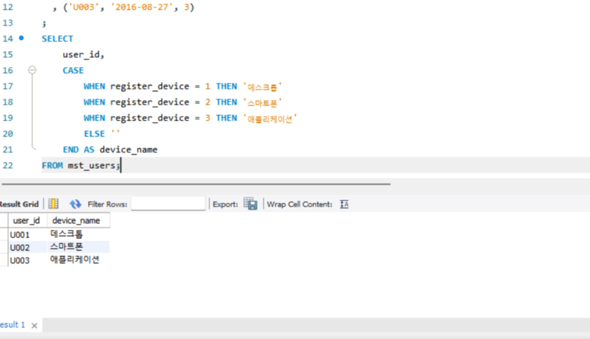

### 1-2 URL에서 요소 추출하기

<!-- 이 부분을 지우고 새롭게 배운 내용을 자유롭게 정리해주세요. -->

```sql
SELECT
    stamp,
    SUBSTRING_INDEX(SUBSTRING_INDEX(referrer, '/', 3), '/', -1) AS referrer_host
FROM access_log;
```

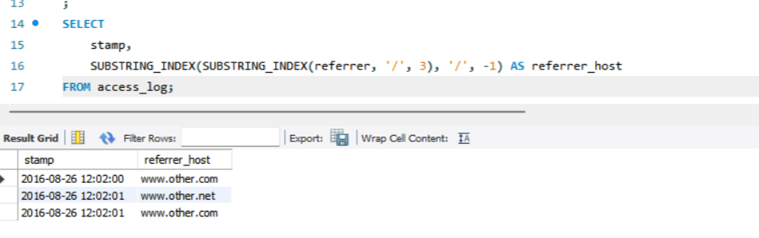

### 1-3 문자열을 배열로 분해하기

<!-- 이 부분을 지우고 새롭게 배운 내용을 자유롭게 정리해주세요. -->

```sql
SELECT
    stamp,
    url,
    SUBSTRING_INDEX(SUBSTRING_INDEX(url, '/', 4), '/', -1) AS path1,
    SUBSTRING_INDEX(SUBSTRING_INDEX(url, '/', 5), '/', -1) AS path2
FROM access_log;
```

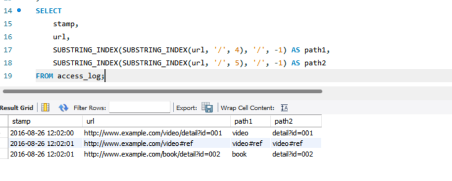

### 1-4 날짜와 타임스탬프 다루기

<!-- 이 부분을 지우고 새롭게 배운 내용을 자유롭게 정리해주세요. -->

```sql
SELECT
    CURRENT_DATE() AS dt,
    CURRENT_TIMESTAMP() AS stamp;
```

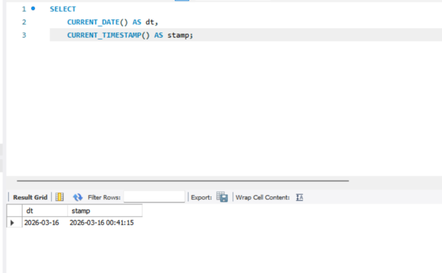

### 1-5 결손 값을 디폴트 값으로 대치하기

<!-- 이 부분을 지우고 새롭게 배운 내용을 자유롭게 정리해주세요. -->

```sql
SELECT
    purchase_id,
    amount,
    coupon,
    amount - coupon AS discount_amount1,
    amount - COALESCE(coupon, 0) AS discount_amount2
FROM purchase_log_with_coupon
;
```

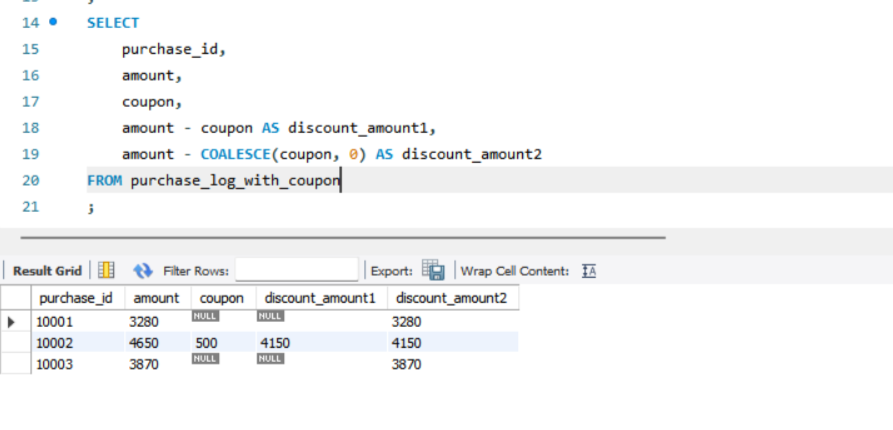


## 2. 여러 개의 값에 대한 조작 

### 2-1 문자열을 연결하기

<!-- 이 부분을 지우고 새롭게 배운 내용을 자유롭게 정리해주세요. -->

```sql
SELECT
    user_id,
    CONCAT(pref_name, ' ', city_name) AS pref_city
FROM mst_user_location;
```

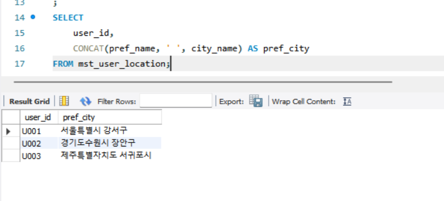

### 2-2 여러 개의 값을 비교하기

<!-- 이 부분을 지우고 새롭게 배운 내용을 자유롭게 정리해주세요. -->

```sql
SELECT
    year,
    q1,
    q2,
    CASE
        WHEN q1 < q2 THEN '+'
        WHEN q1 = q2 THEN '='
        ELSE '-'
    END AS judge_q1_q2,
    q2 - q1 AS diff_q2_q1,
    SIGN(q2 - q1) AS sign_q2_q1
FROM quarterly_sales
ORDER BY year;
```
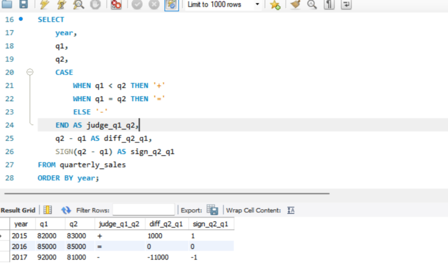

### 2-3 2개의 값 비율 계산하기

<!-- 이 부분을 지우고 새롭게 배운 내용을 자유롭게 정리해주세요. -->

```sql
SELECT
    dt,
    ad_id,
    clicks / impressions AS ctr,
    100.0 * clicks / impressions AS ctr_as_percent
FROM advertising_stats
WHERE dt = '2017-04-01'
ORDER BY dt, ad_id;
```
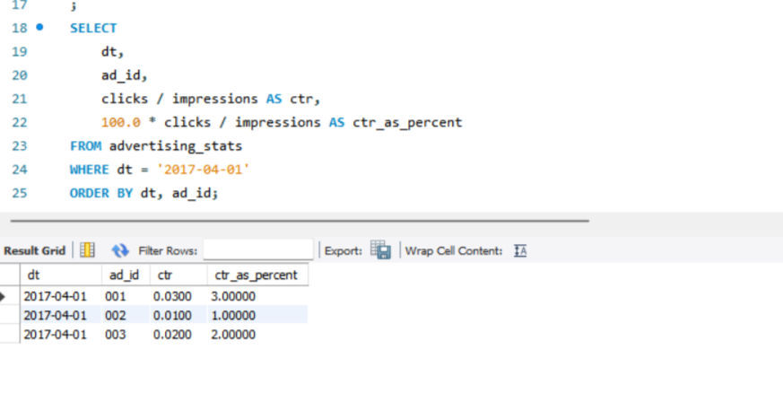

### 2-4 두 값의 거리 계산하기

<!-- 이 부분을 지우고 새롭게 배운 내용을 자유롭게 정리해주세요. -->

```sql
SELECT
    ABS(x1 - x2) AS abs,
    SQRT(POWER(x1 - x2, 2)) AS rms
FROM location_1d;
```
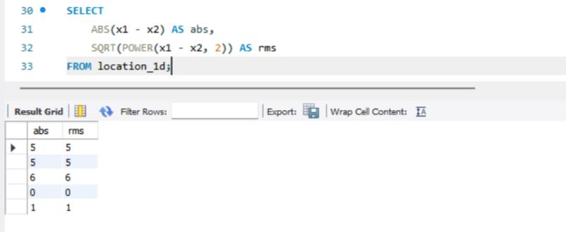

### 2-5 날짜/시간을 계산하기

<!-- 이 부분을 지우고 새롭게 배운 내용을 자유롭게 정리해주세요. -->

```sql
SELECT
    user_id,
    register_stamp,
    register_stamp + INTERVAL 1 HOUR AS after_1_hour,
    register_stamp - INTERVAL 30 MINUTE AS before_30_minutes,
    DATE(register_stamp) AS register_date,
    DATE(register_stamp + INTERVAL 1 DAY) AS after_1_day,
    DATE(register_stamp - INTERVAL 1 MONTH) AS before_1_month
FROM mst_users_with_dates;
```
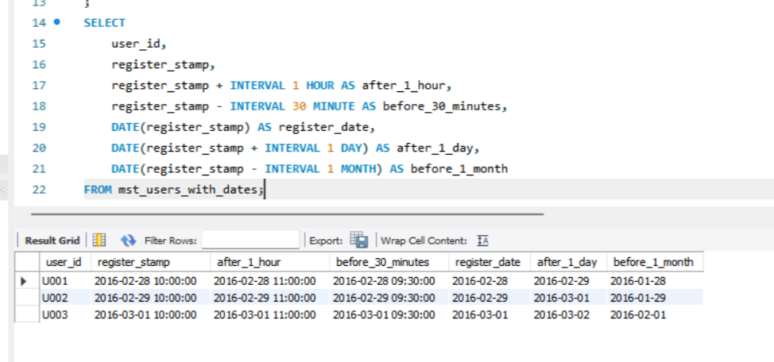

### 2-6 IP 주소 다루기

<!-- 이 부분을 지우고 새롭게 배운 내용을 자유롭게 정리해주세요. -->

```sql
SELECT
    ip,
    CAST(SUBSTRING_INDEX(ip, '.', 1) AS UNSIGNED) * POW(2, 24) +
    CAST(SUBSTRING_INDEX(SUBSTRING_INDEX(ip, '.', 2), '.', -1) AS UNSIGNED) * POW(2, 16) +
    CAST(SUBSTRING_INDEX(SUBSTRING_INDEX(ip, '.', 3), '.', -1) AS UNSIGNED) * POW(2, 8) +
    CAST(SUBSTRING_INDEX(ip, '.', -1) AS UNSIGNED) * POW(2, 0) AS ip_integer
FROM (
    SELECT '192.168.0.1' AS ip
) AS t;
```
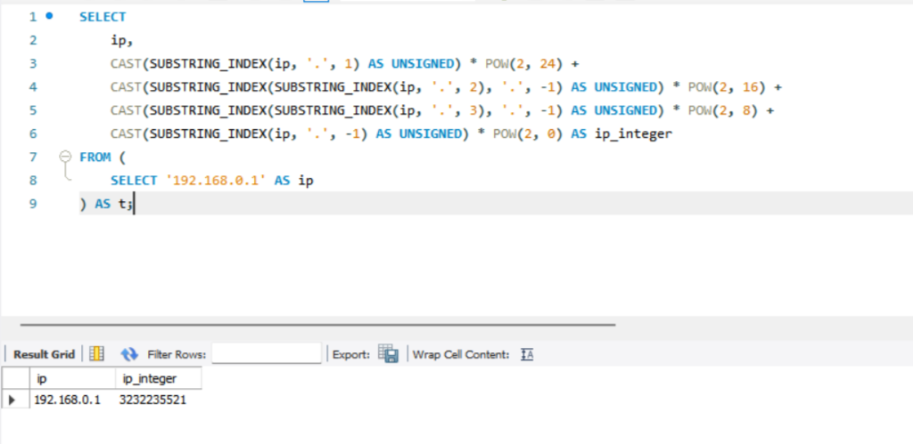

## 03. 하나의 테이블에 대한 조작 

### 3-1 그룹의 특징 잡기

<!-- 이 부분을 지우고 새롭게 배운 내용을 자유롭게 정리해주세요. -->

```sql
SELECT
    COUNT(*) AS total_count,
    COUNT(DISTINCT user_id) AS user_count,
    COUNT(DISTINCT product_id) AS product_count,
    SUM(score) AS sum,
    AVG(score) AS avg,
    MAX(score) AS max,
    MIN(score) AS min
FROM review;
```

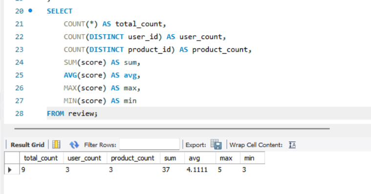

### 3-2 그룹 내부의 순서

<!-- 이 부분을 지우고 새롭게 배운 내용을 자유롭게 정리해주세요. -->

```sql
SELECT
    product_id,
    score,
    ROW_NUMBER() OVER (ORDER BY score DESC) AS row_num,
    RANK() OVER (ORDER BY score DESC) AS rank_num,
    LAG(product_id, 1) OVER (ORDER BY score DESC) AS lag1,
    LAG(product_id, 2) OVER (ORDER BY score DESC) AS lag2,
    LEAD(product_id, 1) OVER (ORDER BY score DESC) AS lead1,
    LEAD(product_id, 2) OVER (ORDER BY score DESC) AS lead2
FROM popular_products
ORDER BY row_num;
```
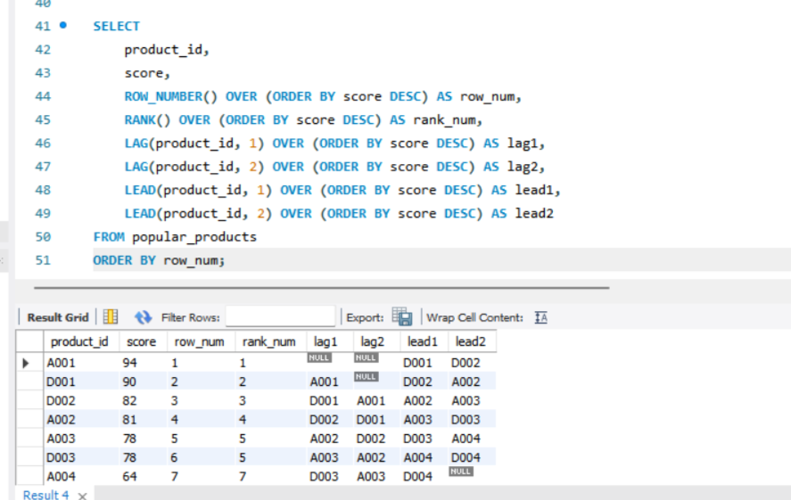

### 3-3 세로 기반 데이터를 가로 기반으로 변환하기

<!-- 이 부분을 지우고 새롭게 배운 내용을 자유롭게 정리해주세요. -->

```sql
SELECT
    dt,
    MAX(CASE WHEN indicator = 'impressions' THEN val END) AS impressions,
    MAX(CASE WHEN indicator = 'sessions' THEN val END) AS sessions,
    MAX(CASE WHEN indicator = 'users' THEN val END) AS users
FROM daily_kpi
GROUP BY dt
ORDER BY dt;
```
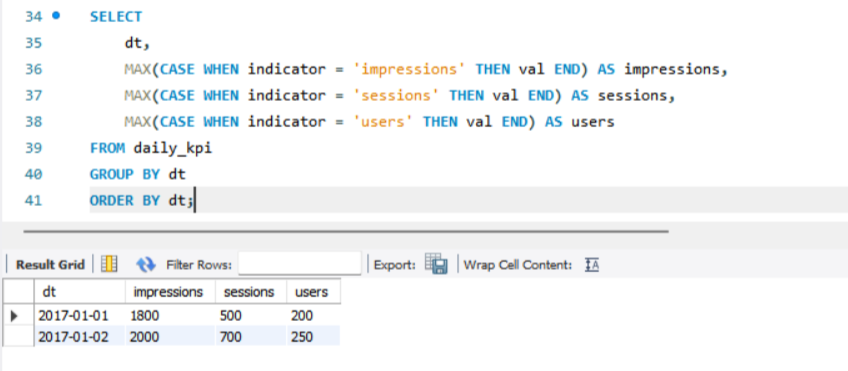

### 3-4 가로 기반 데이터를 세로 기반으로 변환하기

<!-- 이 부분을 지우고 새롭게 배운 내용을 자유롭게 정리해주세요. -->

```sql
SELECT
    q.year,
    CASE
        WHEN p.idx = 1 THEN 'q1'
        WHEN p.idx = 2 THEN 'q2'
        WHEN p.idx = 3 THEN 'q3'
        WHEN p.idx = 4 THEN 'q4'
    END AS quarter,
    CASE
        WHEN p.idx = 1 THEN q.q1
        WHEN p.idx = 2 THEN q.q2
        WHEN p.idx = 3 THEN q.q3
        WHEN p.idx = 4 THEN q.q4
    END AS sales
FROM quarterly_sales AS q
CROSS JOIN (
    SELECT 1 AS idx
    UNION ALL SELECT 2
    UNION ALL SELECT 3
    UNION ALL SELECT 4
) AS p;
```
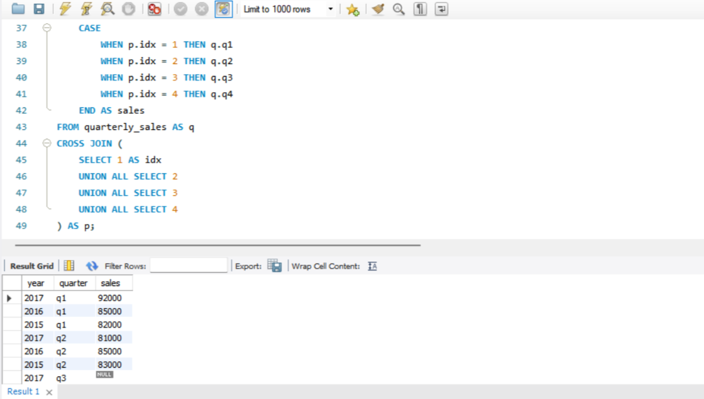


## 04. 여러 개의 테이블 조작하기

### 4-1 여러 개의 테이블을 세로로 결합하기

<!-- 이 부분을 지우고 새롭게 배운 내용을 자유롭게 정리해주세요. -->

```sql
SELECT
    'app1' AS app_name,
    user_id,
    name,
    email
FROM app1_mst_users

UNION ALL

SELECT
    'app2' AS app_name,
    user_id,
    name,
    NULL AS email
FROM app2_mst_users;
```

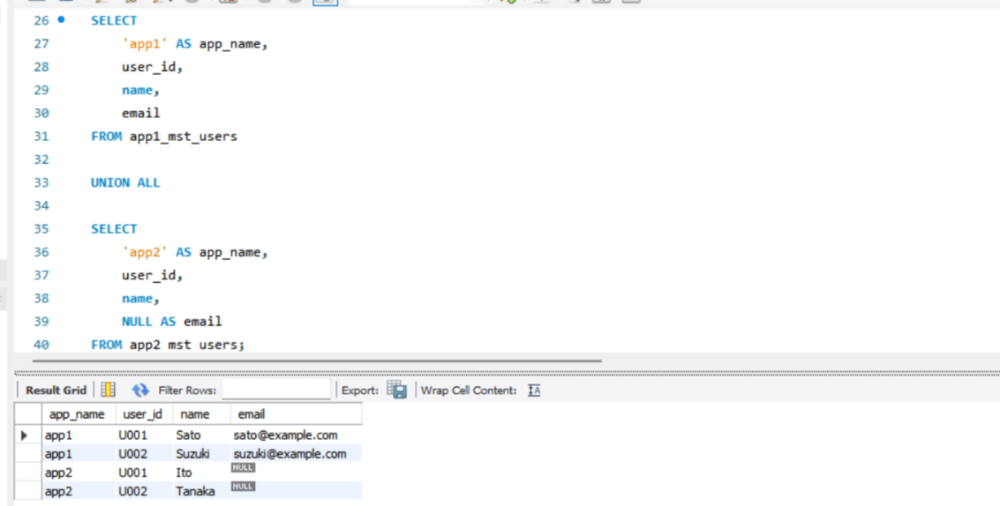

### 4-2 여러 개의 테이블을 가로로 정렬하기

<!-- 이 부분을 지우고 새롭게 배운 내용을 자유롭게 정리해주세요. -->

```sql
SELECT
    m.category_id,
    m.name,
    s.sales,
    r.product_id AS sale_product
FROM mst_categories AS m

JOIN category_sales AS s
    ON m.category_id = s.category_id

JOIN product_sale_ranking AS r
    ON m.category_id = r.category_id;
```
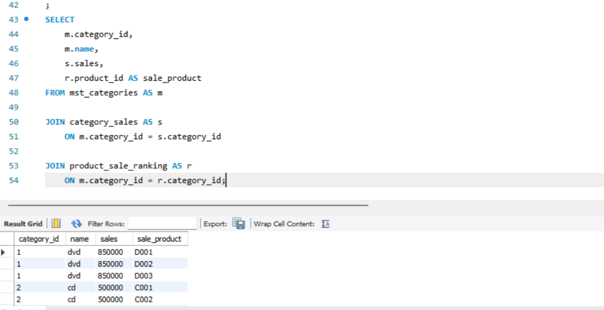

### 4-3 조건 플래그를 0과 1로 표현하기

<!-- 이 부분을 지우고 새롭게 배운 내용을 자유롭게 정리해주세요. -->

```sql
SELECT
    m.user_id,
    m.card_number,
    COUNT(p.user_id) AS purchase_count,

    CASE
        WHEN m.card_number IS NOT NULL THEN 1
        ELSE 0
    END AS has_card,

    SIGN(COUNT(p.user_id)) AS has_purchased

FROM mst_users_with_card_number AS m

LEFT JOIN purchase_log AS p
    ON m.user_id = p.user_id

GROUP BY
    m.user_id,
    m.card_number;
```

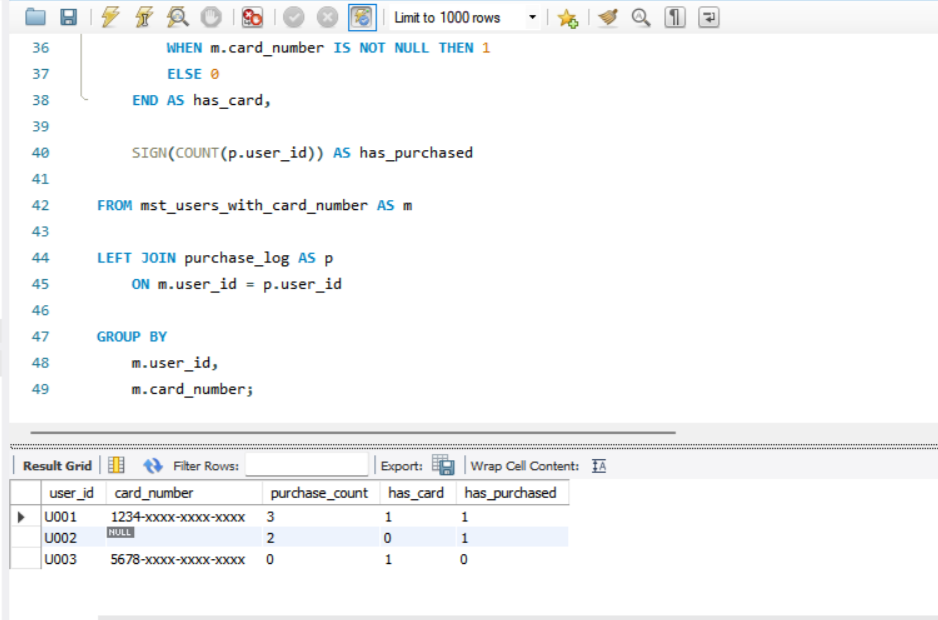

### 4-4 계산한 테이블에 이름 붙여 재사용하기

<!-- 이 부분을 지우고 새롭게 배운 내용을 자유롭게 정리해주세요. -->

```sql
WITH product_sale_ranking AS (
    SELECT
        category_name,
        product_id,
        sales,
        ROW_NUMBER() OVER (
            PARTITION BY category_name
            ORDER BY sales DESC
        ) AS rank_num
    FROM product_sales
)
SELECT *
FROM product_sale_ranking;
```

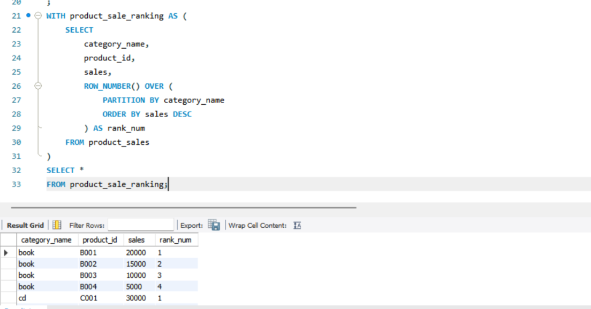

### 4-5 유사 테이블 만들기

<!-- 이 부분을 지우고 새롭게 배운 내용을 자유롭게 정리해주세요. -->

```sql
WITH mst_devices AS (

    SELECT 1 AS device_id, 'PC' AS device_name
    UNION ALL
    SELECT 2 AS device_id, 'SP' AS device_name
    UNION ALL
    SELECT 3 AS device_id, '애플리케이션' AS device_name

)

SELECT *
FROM mst_devices;
```

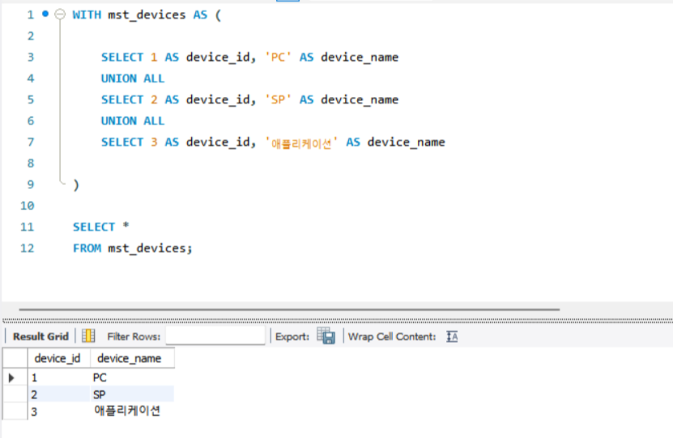


### 🎉 수고하셨습니다.
