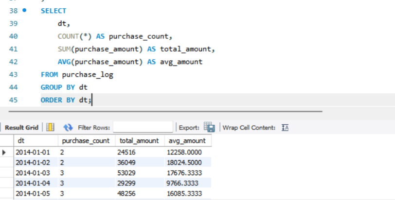
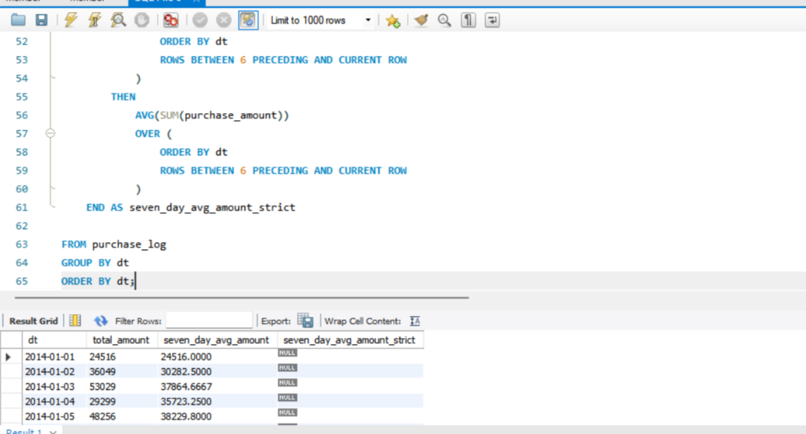
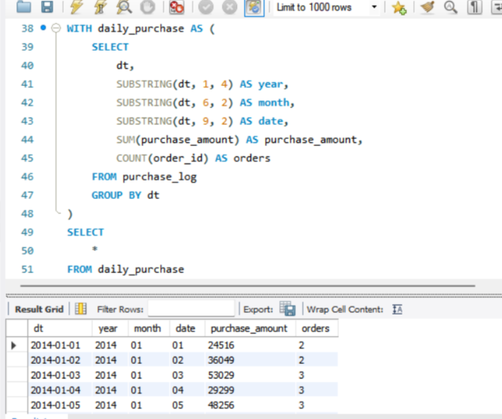
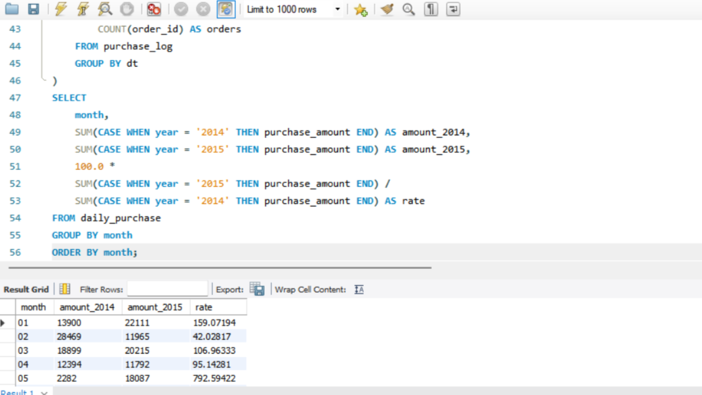
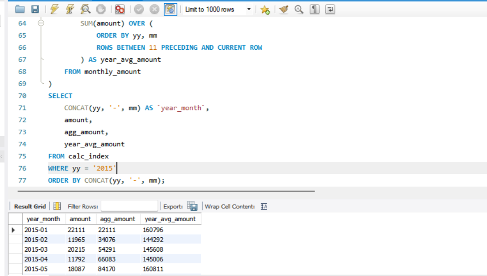
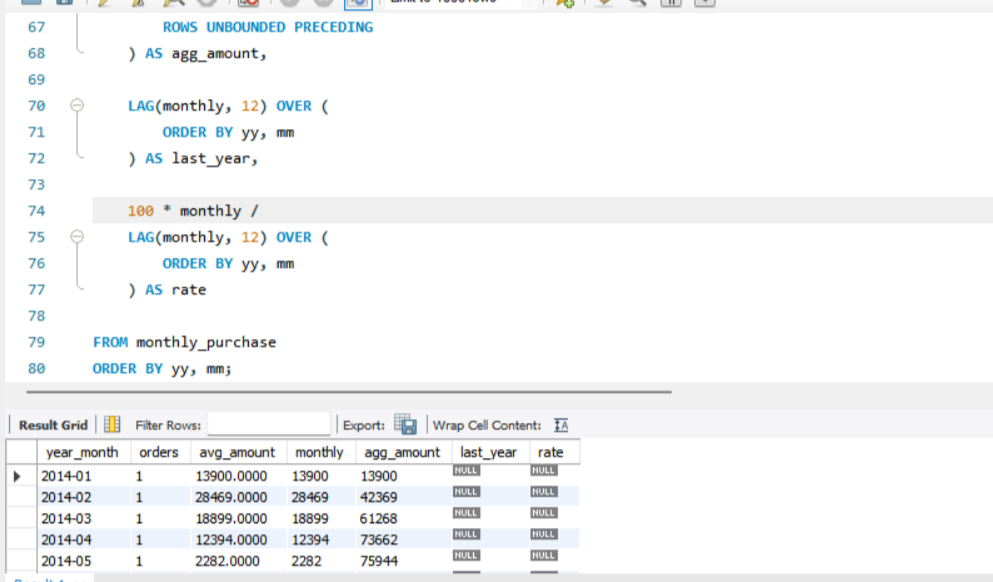
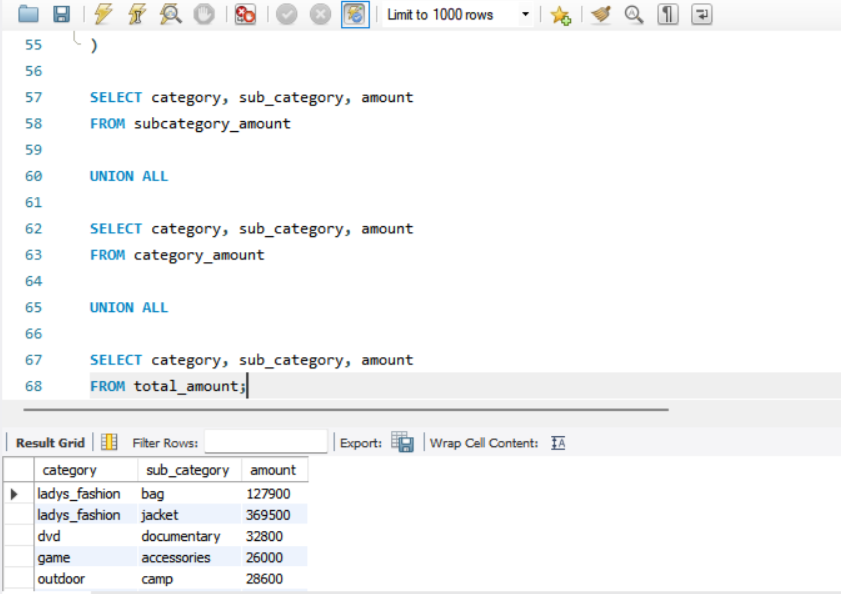
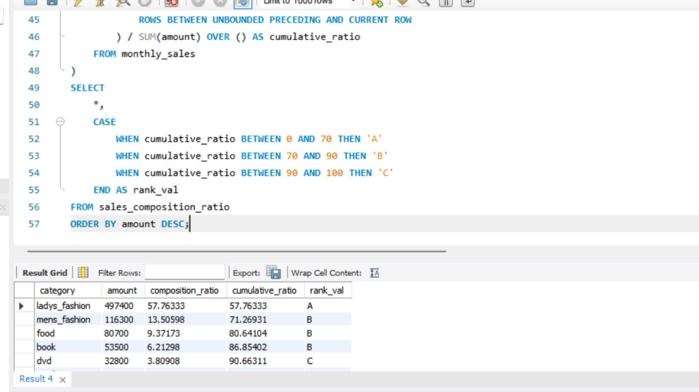
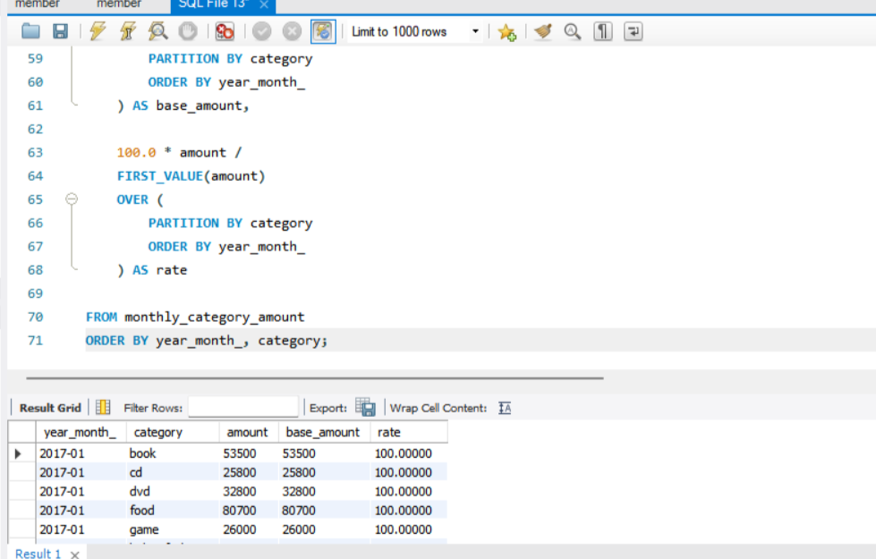
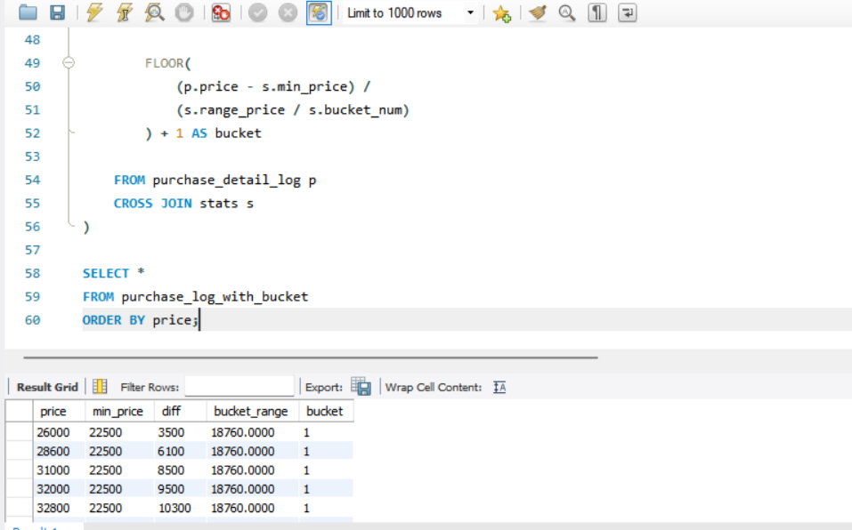

# SQL_MASTER 3주차 정규과제

📌SQL MASTER 정규과제는 매주 정해진 분량의 『*데이터 분석을 위한 SQL 레시피*』 를 읽고 학습하는 것입니다. 이번 주는 아래의 **SQL_MASTER_3rd_TIL**에 나열된 분량을 읽고 공부하시면 됩니다.

아래 실습을 수행하며 학습 내용을 직접 적용해보세요. 단순히 결과를 재현하는 것이 아니라, SQL을 직접 작성하는 과정에서 개념을 스스로 정리하는 것이 중요합니다.

필요한 경우 교재와 추가 자료를 참고하여 이해를 보완하시기 바랍니다.

## SQL_MASTER_3rd_TIL

### 4장 매출을 파악하기 위한 데이터 추출
#### 1. 시계열 기반으로 데이터 집계하기
#### 2. 다면적인 축을 사용해 데이터 집계하기 


## Study Schedule

| 주차  | 공부 범위     | 완료 여부 |
| ----- | ------------- | --------- |
| 1주차 | p.20~50    | ✅         |
| 2주차 | p.52~136   | ✅         |
| 3주차 | p.138~184  | ✅         |
| 4주차 | p.186~232 | 🍽️         |
| 5주차 | p.233~321 | 🍽️         |
| 6주차 | p.324~406 | 🍽️         |
| 7주차 | p.408~464 | 🍽️         |

<br>

<!-- 여기까진 그대로 둬 주세요-->

# 실습

## 0. 실습 규칙

1. 샘플 데이터 생성 코드는 **07_SQL_MASTER_Template/src** 경로에 장별로 정리되어 있습니다.
2. 아래 목차에 맞춰 해당 코드를 실행하여 샘플 데이터를 생성한 후, 각 장에서 요구하는 쿼리를 직접 작성해보시기 바랍니다.
3. 작성한 쿼리의 **실행 결과 화면도 함께 제출**해 주세요.
4. 단순히 교재의 예시 코드를 그대로 작성하는 것이 아니라, **제시된 로직을 충분히 이해한 뒤 교재를 보지 않고 스스로 쿼리를 구성**해보는 것을 권장합니다.
5. 교재 예시는 PostgreSQL, Hive, BigQuery 등 다양한 DBMS 기준으로 제시되어 있기 때문에, **MySQL이 아닌 다른 SQL 환경을 사용하여 실습을 진행해도 무방합니다.**
6. 다만, 사용 중인 DBMS에 맞는 문법으로 적절히 변환하여 작성하시기 바랍니다.


## 1. 시계열 기반으로 데이터 집계하기

### 1-1 날짜별 매출 집계하기

<!-- 이 부분을 지우고 새롭게 배운 내용을 자유롭게 정리해주세요. -->

```sql
SELECT
    dt,
    COUNT(*) AS purchase_count,
    SUM(purchase_amount) AS total_amount,
    AVG(purchase_amount) AS avg_amount
FROM purchase_log
GROUP BY dt
ORDER BY dt;
```


 
### 1-2 이동평균을 사용한 날짜별 추이 보기

<!-- 이 부분을 지우고 새롭게 배운 내용을 자유롭게 정리해주세요. -->

```sql
SELECT
    dt,
    SUM(purchase_amount) AS total_amount,

    AVG(SUM(purchase_amount))
    OVER (
        ORDER BY dt
        ROWS BETWEEN 6 PRECEDING AND CURRENT ROW
    ) AS seven_day_avg_amount,

    CASE
        WHEN
            7 = COUNT(*)
            OVER (
                ORDER BY dt
                ROWS BETWEEN 6 PRECEDING AND CURRENT ROW
            )
        THEN
            AVG(SUM(purchase_amount))
            OVER (
                ORDER BY dt
                ROWS BETWEEN 6 PRECEDING AND CURRENT ROW
            )
    END AS seven_day_avg_amount_strict

FROM purchase_log
GROUP BY dt
ORDER BY dt;
```


 
### 1-3 당월 매출 누계 구하기

<!-- 이 부분을 지우고 새롭게 배운 내용을 자유롭게 정리해주세요. -->

```sql
WITH daily_purchase AS (
    SELECT
        dt,
        SUBSTRING(dt, 1, 4) AS year,
        SUBSTRING(dt, 6, 2) AS month,
        SUBSTRING(dt, 9, 2) AS date,
        SUM(purchase_amount) AS purchase_amount,
        COUNT(order_id) AS orders
    FROM purchase_log
    GROUP BY dt
)
SELECT
    *
FROM daily_purchase
ORDER BY dt;
```



### 1-4 월별 매출의 작대비 구하기

<!-- 이 부분을 지우고 새롭게 배운 내용을 자유롭게 정리해주세요. -->

```sql
WITH daily_purchase AS (
    SELECT
        dt,
        SUBSTRING(dt, 1, 4) AS year,
        SUBSTRING(dt, 6, 2) AS month,
        SUBSTRING(dt, 9, 2) AS date,
        SUM(purchase_amount) AS purchase_amount,
        COUNT(order_id) AS orders
    FROM purchase_log
    GROUP BY dt
)
SELECT
    month,
    SUM(CASE WHEN year = '2014' THEN purchase_amount END) AS amount_2014,
    SUM(CASE WHEN year = '2015' THEN purchase_amount END) AS amount_2015,
    100.0 *
    SUM(CASE WHEN year = '2015' THEN purchase_amount END) /
    SUM(CASE WHEN year = '2014' THEN purchase_amount END) AS rate
FROM daily_purchase
GROUP BY month
ORDER BY month;
```


 
### 1-5 Z 차트로 업적의 추이 확인하기

<!-- 이 부분을 지우고 새롭게 배운 내용을 자유롭게 정리해주세요. -->

```sql
WITH daily_purchase AS (
    SELECT
        dt,
        SUBSTRING(dt, 1, 4) AS yy,
        SUBSTRING(dt, 6, 2) AS mm,
        SUBSTRING(dt, 9, 2) AS dd,
        SUM(purchase_amount) AS purchase_amount,
        COUNT(order_id) AS orders
    FROM purchase_log
    GROUP BY dt
),
monthly_amount AS (
    SELECT
        yy,
        mm,
        SUM(purchase_amount) AS amount
    FROM daily_purchase
    GROUP BY yy, mm
),
calc_index AS (
    SELECT
        yy,
        mm,
        amount,
        SUM(CASE WHEN yy = '2015' THEN amount END) OVER (
            ORDER BY yy, mm
            ROWS UNBOUNDED PRECEDING
        ) AS agg_amount,
        SUM(amount) OVER (
            ORDER BY yy, mm
            ROWS BETWEEN 11 PRECEDING AND CURRENT ROW
        ) AS year_avg_amount
    FROM monthly_amount
)
SELECT
    CONCAT(yy, '-', mm) AS `year_month`,
    amount,
    agg_amount,
    year_avg_amount
FROM calc_index
WHERE yy = '2015'
ORDER BY CONCAT(yy, '-', mm);
```


 
### 1-6 매출을 파악할 때 중요 포인트 

<!-- 이 부분을 지우고 새롭게 배운 내용을 자유롭게 정리해주세요. -->

```sql
WITH daily_purchase AS (
    SELECT
        dt,
        SUBSTRING(dt,1,4) AS yy,
        SUBSTRING(dt,6,2) AS mm,
        SUM(purchase_amount) AS purchase_amount,
        COUNT(order_id) AS orders
    FROM purchase_log
    GROUP BY dt
),

monthly_purchase AS (
    SELECT
        yy,
        mm,
        SUM(orders) AS orders,
        AVG(purchase_amount) AS avg_amount,
        SUM(purchase_amount) AS monthly
    FROM daily_purchase
    GROUP BY yy, mm
)

SELECT
    CONCAT(yy,'-',mm) AS year_month,
    orders,
    avg_amount,
    monthly,

    SUM(monthly) OVER (
        PARTITION BY yy
        ORDER BY mm
        ROWS UNBOUNDED PRECEDING
    ) AS agg_amount,

    LAG(monthly, 12) OVER (
        ORDER BY yy, mm
    ) AS last_year,

    100 * monthly /
    LAG(monthly, 12) OVER (
        ORDER BY yy, mm
    ) AS rate

FROM monthly_purchase
ORDER BY yy, mm;
```



## 2. 다면적인 축을 사용해 데이터 집계하기 

### 2-1 카테고리별 매출과 소계 계산하기

<!-- 이 부분을 지우고 새롭게 배운 내용을 자유롭게 정리해주세요. -->

```sql
WITH subcategory_amount AS (
    SELECT
        category,
        sub_category,
        SUM(price) AS amount
    FROM purchase_detail_log
    GROUP BY category, sub_category
),

category_amount AS (
    SELECT
        category,
        'all' AS sub_category,
        SUM(price) AS amount
    FROM purchase_detail_log
    GROUP BY category
),

total_amount AS (
    SELECT
        'all' AS category,
        'all' AS sub_category,
        SUM(price) AS amount
    FROM purchase_detail_log
)

SELECT category, sub_category, amount
FROM subcategory_amount

UNION ALL

SELECT category, sub_category, amount
FROM category_amount

UNION ALL

SELECT category, sub_category, amount
FROM total_amount;
```


### 2-2 ABC 분석으로 잘 팔리는 상품 판별하기

<!-- 이 부분을 지우고 새롭게 배운 내용을 자유롭게 정리해주세요. -->

```sql
WITH monthly_sales AS (
    SELECT
        category,
        SUM(price) AS amount
    FROM purchase_detail_log
    GROUP BY category
),
sales_composition_ratio AS (
    SELECT
        category,
        amount,
        100.0 * amount / SUM(amount) OVER () AS composition_ratio,
        100.0 * SUM(amount) OVER (
            ORDER BY amount DESC
            ROWS BETWEEN UNBOUNDED PRECEDING AND CURRENT ROW
        ) / SUM(amount) OVER () AS cumulative_ratio
    FROM monthly_sales
)
SELECT
    *,
    CASE
        WHEN cumulative_ratio BETWEEN 0 AND 70 THEN 'A'
        WHEN cumulative_ratio BETWEEN 70 AND 90 THEN 'B'
        WHEN cumulative_ratio BETWEEN 90 AND 100 THEN 'C'
    END AS rank_val
FROM sales_composition_ratio
ORDER BY amount DESC;
```


### 2-3 팬 차트로 상품의 매출 증가율 확인하기

<!-- 이 부분을 지우고 새롭게 배운 내용을 자유롭게 정리해주세요. -->

```sql
 WITH daily_category_amount AS (
    SELECT
        dt,
        category,
        SUBSTRING(dt, 1, 4) AS year,
        SUBSTRING(dt, 6, 2) AS month,
        SUBSTRING(dt, 9, 2) AS day,
        SUM(price) AS amount
    FROM purchase_detail_log
    GROUP BY dt, category
),

monthly_category_amount AS (
    SELECT
        CONCAT(year, '-', month) AS year_month_,
        category,
        SUM(amount) AS amount
    FROM daily_category_amount
    GROUP BY year, month, category
)

SELECT
    year_month_,
    category,
    amount,

    FIRST_VALUE(amount)
    OVER (
        PARTITION BY category
        ORDER BY year_month_
    ) AS base_amount,

    100.0 * amount /
    FIRST_VALUE(amount)
    OVER (
        PARTITION BY category
        ORDER BY year_month_
    ) AS rate

FROM monthly_category_amount
ORDER BY year_month_, category;
```



### 2-4 히스토그램으로 구매 가격대 집계하기 

<!-- 이 부분을 지우고 새롭게 배운 내용을 자유롭게 정리해주세요. -->

```sql
WITH stats AS (
    SELECT
        MIN(price) AS min_price,
        MAX(price) AS max_price,
        MAX(price) - MIN(price) AS range_price,
        5 AS bucket_num
    FROM purchase_detail_log
),

purchase_log_with_bucket AS (
    SELECT
        p.price,
        s.min_price,

        p.price - s.min_price AS diff,

        s.range_price / s.bucket_num AS bucket_range,

        FLOOR(
            (p.price - s.min_price) /
            (s.range_price / s.bucket_num)
        ) + 1 AS bucket

    FROM purchase_detail_log p
    CROSS JOIN stats s
)

SELECT *
FROM purchase_log_with_bucket
ORDER BY price;
```
 


### 🎉 수고하셨습니다.
