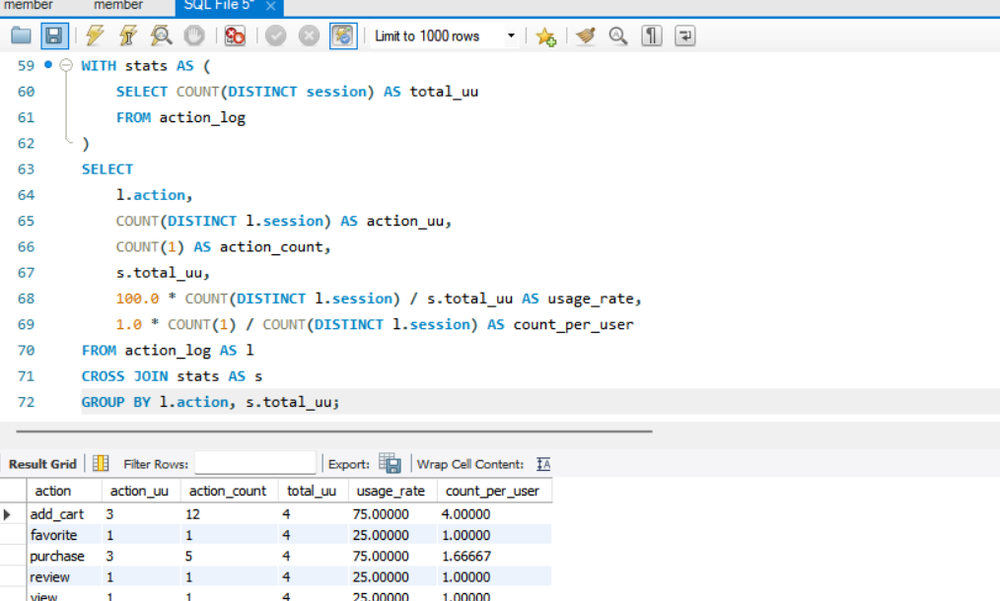
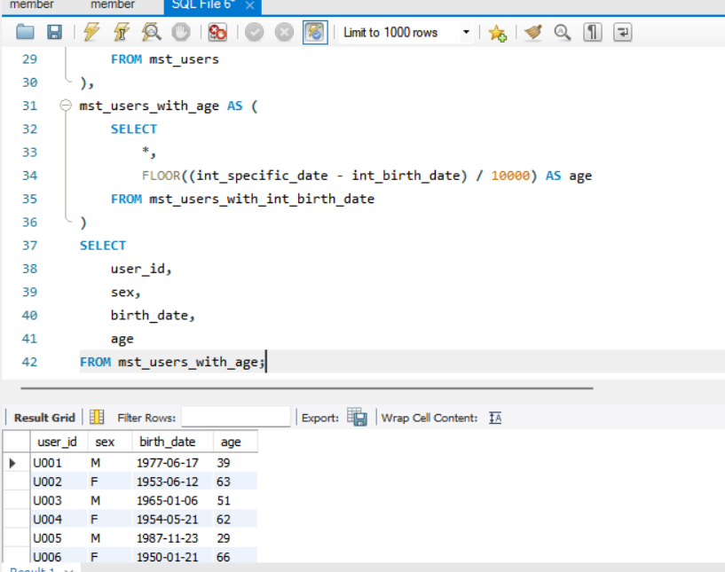
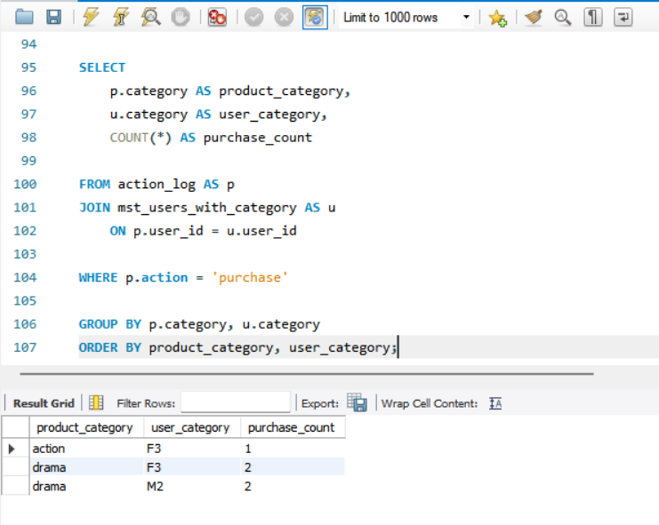
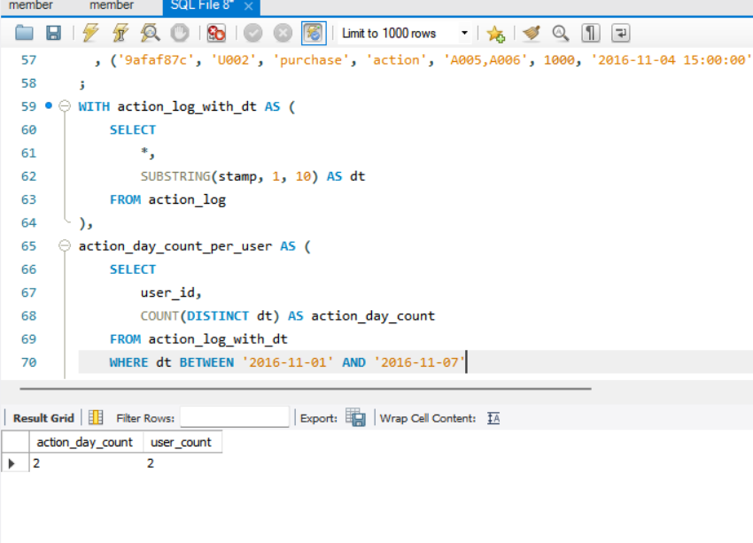
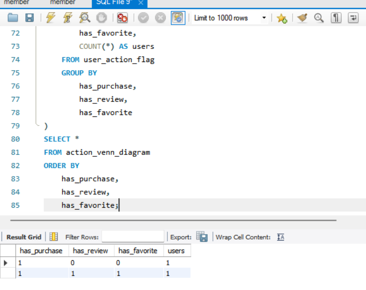
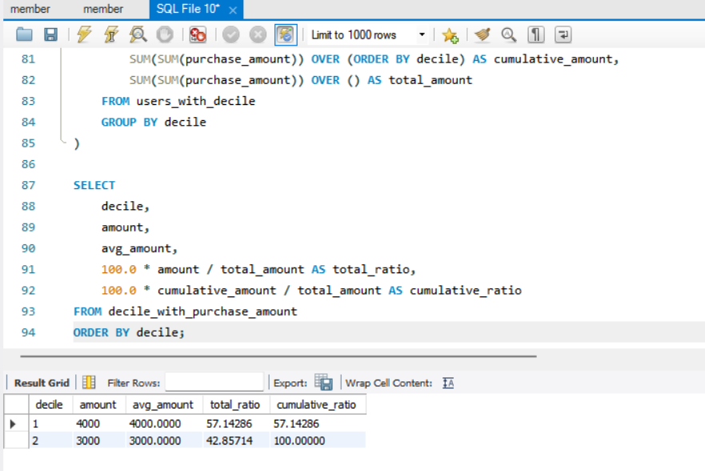
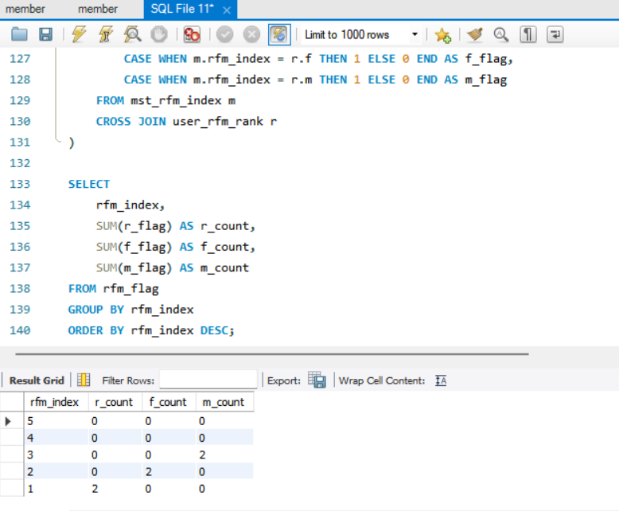

# SQL_MASTER 4주차 정규과제

📌SQL MASTER 정규과제는 매주 정해진 분량의 『*데이터 분석을 위한 SQL 레시피*』 를 읽고 학습하는 것입니다. 이번 주는 아래의 **SQL_MASTER_4th_TIL**에 나열된 분량을 읽고 공부하시면 됩니다.

아래 실습을 수행하며 학습 내용을 직접 적용해보세요. 단순히 결과를 재현하는 것이 아니라, SQL을 직접 작성하는 과정에서 개념을 스스로 정리하는 것이 중요합니다.

필요한 경우 교재와 추가 자료를 참고하여 이해를 보완하시기 바랍니다.

## SQL_MASTER_4th_TIL

### 5장 사용자를 파악하기 위한 데이터 추출
#### 1. 사용자 전체의 특징과 경향 찾기


## Study Schedule

| 주차  | 공부 범위     | 완료 여부 |
| ----- | ------------- | --------- |
| 1주차 | p.20~50    | ✅         |
| 2주차 | p.52~136   | ✅         |
| 3주차 | p.138~184  | ✅         |
| 4주차 | p.186~232 | ✅         |
| 5주차 | p.233~321 | 🍽️         |
| 6주차 | p.324~406 | 🍽️         |
| 7주차 | p.408~464 | 🍽️         |

<br>

<!-- 여기까진 그대로 둬 주세요-->


# 실습

## 0. 실습 규칙

1. 샘플 데이터 생성 코드는 **07_SQL_MASTER_Template/src** 경로에 장별로 정리되어 있습니다.
2. 아래 목차에 맞춰 해당 코드를 실행하여 샘플 데이터를 생성한 후, 각 장에서 요구하는 쿼리를 직접 작성해보시기 바랍니다.
3. 작성한 쿼리의 **실행 결과 화면도 함께 제출**해 주세요.
4. 단순히 교재의 예시 코드를 그대로 작성하는 것이 아니라, **제시된 로직을 충분히 이해한 뒤 교재를 보지 않고 스스로 쿼리를 구성**해보는 것을 권장합니다.
5. 교재 예시는 PostgreSQL, Hive, BigQuery 등 다양한 DBMS 기준으로 제시되어 있기 때문에, **MySQL이 아닌 다른 SQL 환경을 사용하여 실습을 진행해도 무방합니다.**
6. 다만, 사용 중인 DBMS에 맞는 문법으로 적절히 변환하여 작성하시기 바랍니다.

## 1. 사용자 전체의 특징과 경향 찾기

### 1-1 사용자의 액션 수 집계하기

<!-- 이 부분을 지우고 새롭게 배운 내용을 자유롭게 정리해주세요. -->

```sql
WITH stats AS (
    SELECT COUNT(DISTINCT session) AS total_uu
    FROM action_log
)
SELECT
    l.action,
    COUNT(DISTINCT l.session) AS action_uu,
    COUNT(1) AS action_count,
    s.total_uu,
    100.0 * COUNT(DISTINCT l.session) / s.total_uu AS usage_rate,
    1.0 * COUNT(1) / COUNT(DISTINCT l.session) AS count_per_user
FROM action_log AS l
CROSS JOIN stats AS s
GROUP BY l.action, s.total_uu;
```


### 1-2 연령별 구분 집계하기

<!-- 이 부분을 지우고 새롭게 배운 내용을 자유롭게 정리해주세요. -->

```sql
WITH mst_users_with_int_birth_date AS (
    SELECT
        *,
        20170101 AS int_specific_date,
        CAST(REPLACE(SUBSTRING(birth_date, 1, 10), '-', '') AS UNSIGNED) AS int_birth_date
    FROM mst_users
),
mst_users_with_age AS (
    SELECT
        *,
        FLOOR((int_specific_date - int_birth_date) / 10000) AS age
    FROM mst_users_with_int_birth_date
)
SELECT
    user_id,
    sex,
    birth_date,
    age
FROM mst_users_with_age;
```



### 1-3 연령별 구분의 특징 추출하기

<!-- 이 부분을 지우고 새롭게 배운 내용을 자유롭게 정리해주세요. -->

```sql
WITH mst_users_with_int_birth_date AS (
    SELECT
        *,
        20170101 AS int_specific_date,
        CAST(REPLACE(SUBSTRING(birth_date, 1, 10), '-', '') AS UNSIGNED) AS int_birth_date
    FROM mst_users
),

mst_users_with_age AS (
    SELECT
        *,
        FLOOR((int_specific_date - int_birth_date) / 10000) AS age
    FROM mst_users_with_int_birth_date
),

mst_users_with_category AS (
    SELECT
        user_id,
        sex,
        age,
        CONCAT(
            CASE
                WHEN 20 <= age THEN sex
                ELSE ''
            END,
            CASE
                WHEN age BETWEEN 4 AND 12 THEN 'C'
                WHEN age BETWEEN 13 AND 19 THEN 'T'
                WHEN age BETWEEN 20 AND 34 THEN '1'
                WHEN age BETWEEN 35 AND 49 THEN '2'
                WHEN age >= 50 THEN '3'
            END
        ) AS category
    FROM mst_users_with_age
)

SELECT
    p.category AS product_category,
    u.category AS user_category,
    COUNT(*) AS purchase_count

FROM action_log AS p
JOIN mst_users_with_category AS u
    ON p.user_id = u.user_id

WHERE p.action = 'purchase'

GROUP BY p.category, u.category
ORDER BY product_category, user_category;
```

 

### 1-4 사용자의 방문 빈도 집계하기

<!-- 이 부분을 지우고 새롭게 배운 내용을 자유롭게 정리해주세요. -->

```sql
WITH action_log_with_dt AS (
    SELECT
        *,
        SUBSTRING(stamp, 1, 10) AS dt
    FROM action_log
),
action_day_count_per_user AS (
    SELECT
        user_id,
        COUNT(DISTINCT dt) AS action_day_count
    FROM action_log_with_dt
    WHERE dt BETWEEN '2016-11-01' AND '2016-11-07'
    GROUP BY user_id
)
SELECT
    action_day_count,
    COUNT(DISTINCT user_id) AS user_count
FROM action_day_count_per_user
GROUP BY action_day_count
ORDER BY action_day_count;
```



### 1-5 벤 다이어그램으로 사용자 액션 집계하기

<!-- 이 부분을 지우고 새롭게 배운 내용을 자유롭게 정리해주세요. -->

```sql
WITH user_action_flag AS (
    SELECT
        user_id,
        SIGN(SUM(CASE WHEN action = 'purchase' THEN 1 ELSE 0 END)) AS has_purchase,
        SIGN(SUM(CASE WHEN action = 'review' THEN 1 ELSE 0 END)) AS has_review,
        SIGN(SUM(CASE WHEN action = 'favorite' THEN 1 ELSE 0 END)) AS has_favorite
    FROM action_log
    GROUP BY user_id
),
action_venn_diagram AS (
    SELECT
        has_purchase,
        has_review,
        has_favorite,
        COUNT(*) AS users
    FROM user_action_flag
    GROUP BY
        has_purchase,
        has_review,
        has_favorite
)
SELECT *
FROM action_venn_diagram
ORDER BY
    has_purchase,
    has_review,
    has_favorite;
```


### 1-6 Decile 분석을 사용해 사용자를 10단계 그룹으로 나누기

<!-- 이 부분을 지우고 새롭게 배운 내용을 자유롭게 정리해주세요. -->

```sql
WITH user_purchase_amount AS (
    SELECT
        user_id,
        SUM(amount) AS purchase_amount
    FROM action_log
    WHERE action = 'purchase'
    GROUP BY user_id
),

users_with_decile AS (
    SELECT
        user_id,
        purchase_amount,
        NTILE(10) OVER (ORDER BY purchase_amount DESC) AS decile
    FROM user_purchase_amount
),

decile_with_purchase_amount AS (
    SELECT
        decile,
        SUM(purchase_amount) AS amount,
        AVG(purchase_amount) AS avg_amount,
        SUM(SUM(purchase_amount)) OVER (ORDER BY decile) AS cumulative_amount,
        SUM(SUM(purchase_amount)) OVER () AS total_amount
    FROM users_with_decile
    GROUP BY decile
)

SELECT
    decile,
    amount,
    avg_amount,
    100.0 * amount / total_amount AS total_ratio,
    100.0 * cumulative_amount / total_amount AS cumulative_ratio
FROM decile_with_purchase_amount
ORDER BY decile;
```



### 1-7 RFM 분석으로 사용자를 3가지 관점의 그룹으로 나누기

<!-- 이 부분을 지우고 새롭게 배운 내용을 자유롭게 정리해주세요. -->

```sql
WITH purchase_log AS (
    SELECT
        user_id,
        amount,
        SUBSTRING(stamp, 1, 10) AS dt
    FROM action_log
    WHERE action = 'purchase'
),

user_rfm AS (
    SELECT
        user_id,
        MAX(dt) AS recent_date,
        DATEDIFF(CURRENT_DATE(), MAX(dt)) AS recency,
        COUNT(dt) AS frequency,
        SUM(amount) AS monetary
    FROM purchase_log
    GROUP BY user_id
),

user_rfm_rank AS (
    SELECT
        user_id,
        recency,
        frequency,
        monetary,

        -- R 점수
        CASE
            WHEN recency < 14 THEN 5
            WHEN recency < 28 THEN 4
            WHEN recency < 60 THEN 3
            WHEN recency < 90 THEN 2
            ELSE 1
        END AS r,

        -- F 점수
        CASE
            WHEN frequency >= 20 THEN 5
            WHEN frequency >= 10 THEN 4
            WHEN frequency >= 5 THEN 3
            WHEN frequency >= 2 THEN 2
            ELSE 1
        END AS f,

        -- M 점수
        CASE
            WHEN monetary >= 30000 THEN 5
            WHEN monetary >= 10000 THEN 4
            WHEN monetary >= 3000 THEN 3
            WHEN monetary >= 500 THEN 2
            ELSE 1
        END AS m
    FROM user_rfm
),

mst_rfm_index AS (
    SELECT 1 AS rfm_index
    UNION ALL SELECT 2
    UNION ALL SELECT 3
    UNION ALL SELECT 4
    UNION ALL SELECT 5
),

rfm_flag AS (
    SELECT
        m.rfm_index,
        CASE WHEN m.rfm_index = r.r THEN 1 ELSE 0 END AS r_flag,
        CASE WHEN m.rfm_index = r.f THEN 1 ELSE 0 END AS f_flag,
        CASE WHEN m.rfm_index = r.m THEN 1 ELSE 0 END AS m_flag
    FROM mst_rfm_index m
    CROSS JOIN user_rfm_rank r
)

SELECT
    rfm_index,
    SUM(r_flag) AS r_count,
    SUM(f_flag) AS f_count,
    SUM(m_flag) AS m_count
FROM rfm_flag
GROUP BY rfm_index
ORDER BY rfm_index DESC;
```




### 🎉 수고하셨습니다.
