# SQL_MASTER 5주차 정규과제

📌SQL MASTER 정규과제는 매주 정해진 분량의 『*데이터 분석을 위한 SQL 레시피*』 를 읽고 학습하는 것입니다. 이번 주는 아래의 **SQL_MASTER_5th_TIL**에 나열된 분량을 읽고 공부하시면 됩니다.

아래 실습을 수행하며 학습 내용을 직접 적용해보세요. 단순히 결과를 재현하는 것이 아니라, SQL을 직접 작성하는 과정에서 개념을 스스로 정리하는 것이 중요합니다.

필요한 경우 교재와 추가 자료를 참고하여 이해를 보완하시기 바랍니다.

## SQL_MASTER_5th_TIL

### 5장 사용자를 파악하기 위한 데이터 추출
#### 2. 시계열에 따른 사용자 전체의 상태 변화 찾기
#### 3. 시계열에 따른 사용자의 개별적인 행동 분석하기 


## Study Schedule

| 주차  | 공부 범위     | 완료 여부 |
| ----- | ------------- | --------- |
| 1주차 | p.20~50    | ✅         |
| 2주차 | p.52~136   | ✅         |
| 3주차 | p.138~184  | ✅         |
| 4주차 | p.186~232 | ✅         |
| 5주차 | p.233~321 | ✅         |
| 6주차 | p.324~406 | 🍽️         |
| 7주차 | p.408~464 | 🍽️         |

<br>

<!-- 여기까진 그대로 둬 주세요-->


# 실습 

## 0. 실습 규칙

1. 샘플 데이터 생성 코드는 **07_SQL_MASTER_Template/src** 경로에 장별로 정리되어 있습니다.
2. 아래 목차에 맞춰 해당 코드를 실행하여 샘플 데이터를 생성한 후, 각 장에서 요구하는 쿼리를 직접 작성해보시기 바랍니다.
3. 작성한 쿼리의 **실행 결과 화면도 함께 제출**해 주세요.
4. 단순히 교재의 예시 코드를 그대로 작성하는 것이 아니라, **제시된 로직을 충분히 이해한 뒤 교재를 보지 않고 스스로 쿼리를 구성**해보는 것을 권장합니다.
5. 교재 예시는 PostgreSQL, Hive, BigQuery 등 다양한 DBMS 기준으로 제시되어 있기 때문에, **MySQL이 아닌 다른 SQL 환경을 사용하여 실습을 진행해도 무방합니다.**
6. 다만, 사용 중인 DBMS에 맞는 문법으로 적절히 변환하여 작성하시기 바랍니다.

## 2. 시계열에 따른 사용자 전체의 상태 변화 찾기

### 2-1 등록 수의 추이와 경향 보기

<!-- 이 부분을 지우고 새롭게 배운 내용을 자유롭게 정리해주세요. -->

```sql
SELECT
    register_date,
    COUNT(DISTINCT user_id) AS register_count
FROM mst_users
GROUP BY register_date
ORDER BY register_date;

WITH mst_users_with_year_month AS (
    SELECT
        *,
        SUBSTRING(register_date, 1, 7) AS year_month
    FROM mst_users
),

monthly_counts AS (
    SELECT
        year_month,
        COUNT(DISTINCT user_id) AS register_count
    FROM mst_users_with_year_month
    GROUP BY year_month
)

SELECT
    year_month,
    register_count,

    LAG(register_count) OVER (ORDER BY year_month) AS last_month_count,

    1.0 * register_count /
    LAG(register_count) OVER (ORDER BY year_month) AS month_over_month_ratio

FROM monthly_counts
ORDER BY year_month;
```

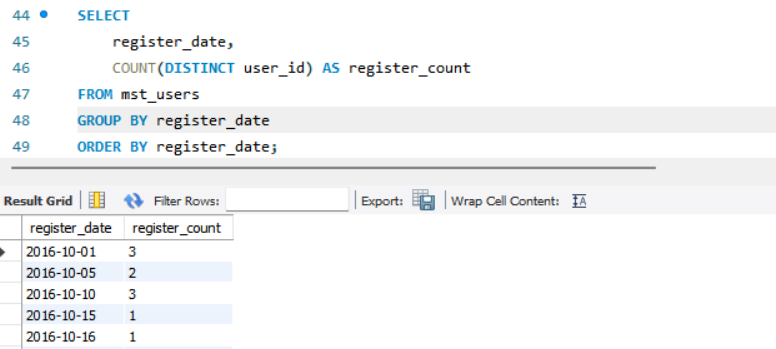

### 2-2 지속률과 정착률 산출하기

<!-- 이 부분을 지우고 새롭게 배운 내용을 자유롭게 정리해주세요. -->

```sql
WITH action_log_with_mst_users AS (
    SELECT
        u.user_id,
        u.register_date,
        DATE(a.stamp) AS action_date,
        MAX(DATE(a.stamp)) OVER () AS latest_date,
        DATE_ADD(CAST(u.register_date AS DATE), INTERVAL 1 DAY) AS register_next_day_1
    FROM mst_users AS u
    LEFT OUTER JOIN action_log AS a
        ON u.user_id = a.user_id
)
SELECT *
FROM action_log_with_mst_users
ORDER BY register_date;
```

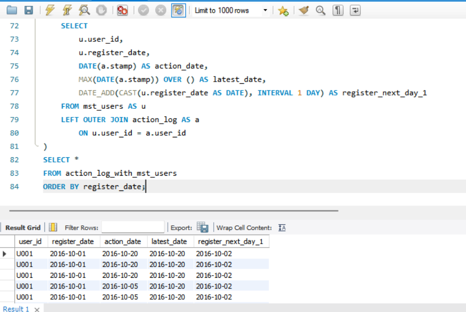

### 2-3 지속과 정착에 영향을 주는 액션 집계하기 

<!-- 이 부분을 지우고 새롭게 배운 내용을 자유롭게 정리해주세요. -->

```sql
WITH repeat_interval AS (
    SELECT '01 day repeat' AS index_name, 1 AS interval_begin_date, 1 AS interval_end_date
),

mst_actions AS (
    SELECT 'view' AS action
    UNION ALL SELECT 'comment'
    UNION ALL SELECT 'follow'
),

mst_user_actions AS (
    SELECT
        u.user_id,
        u.register_date,
        a.action
    FROM mst_users AS u
    CROSS JOIN mst_actions AS a
),

action_log_with_index_date AS (
    SELECT
        u.user_id,
        a.action,
        r.index_name,
        100.0 * DATEDIFF(DATE(a.stamp), CAST(u.register_date AS DATE)) AS index_date_action
    FROM mst_users AS u
    JOIN action_log AS a
        ON u.user_id = a.user_id
    CROSS JOIN repeat_interval AS r
),

user_action_flag AS (
    SELECT DISTINCT
        user_id,
        index_name,
        index_date_action
    FROM action_log_with_index_date
),

register_action_flag AS (
    SELECT DISTINCT
        m.user_id,
        m.register_date,
        m.action,
        CASE
            WHEN a.action IS NOT NULL THEN 1
            ELSE 0
        END AS do_action,
        f.index_name,
        f.index_date_action
    FROM mst_user_actions AS m
    LEFT JOIN action_log AS a
        ON m.user_id = a.user_id
       AND CAST(m.register_date AS DATE) = DATE(a.stamp)
       AND m.action = a.action
    LEFT JOIN user_action_flag AS f
        ON m.user_id = f.user_id
    WHERE f.index_date_action IS NOT NULL
)

SELECT
    action,
    COUNT(1) AS users,
    AVG(100.0 * do_action) AS usage_rate,
    index_name,
    AVG(CASE WHEN do_action = 1 THEN 100.0 * index_date_action END) AS idx_rate,
    AVG(CASE WHEN do_action = 0 THEN 100.0 * index_date_action END) AS no_action_idx_rate
FROM register_action_flag
GROUP BY index_name, action
ORDER BY index_name, action;
```

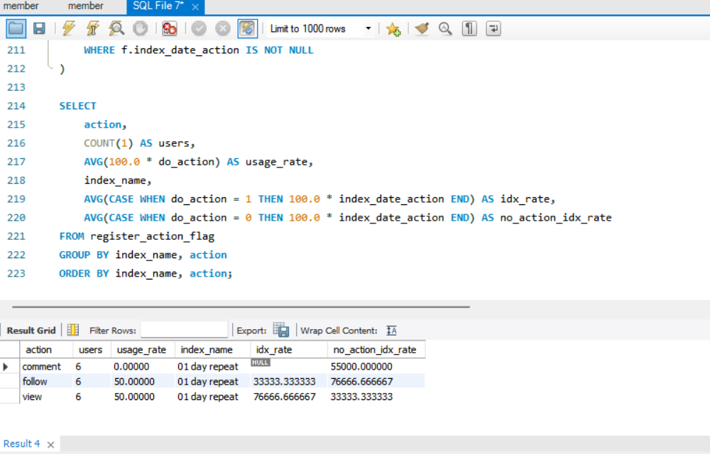 

### 2-4 액션 수에 따른 정착률 집계하기 

<!-- 이 부분을 지우고 새롭게 배운 내용을 자유롭게 정리해주세요. -->

```sql
WITH RECURSIVE
repeat_interval AS (
    SELECT '14 day retention' AS index_name,
           8 AS interval_begin_date,
           14 AS interval_end_date
),

action_log_with_index_date AS (
),

user_action_flag AS (
),

mst_action_bucket AS (
    SELECT 'comment' AS action, 0 AS min_count, 0 AS max_count
    UNION ALL
    SELECT 'comment', 1, 5
    UNION ALL
    SELECT 'comment', 6, 10
    UNION ALL
    SELECT 'comment', 11, 9999
    UNION ALL
    SELECT 'follow', 0, 0
    UNION ALL
    SELECT 'follow', 1, 5
    UNION ALL
    SELECT 'follow', 6, 10
    UNION ALL
    SELECT 'follow', 11, 9999
),

mst_user_action_bucket AS (
    SELECT
        u.user_id,
        u.register_date,
        a.action,
        a.min_count,
        a.max_count
    FROM mst_users AS u
    CROSS JOIN mst_action_bucket AS a
)

SELECT *
FROM mst_user_action_bucket
ORDER BY user_id, action, min_count;
```

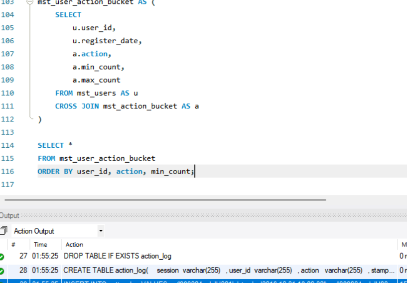

### 2-5 사용 일수에 따른 정착률 집계하기 

<!-- 이 부분을 지우고 새롭게 배운 내용을 자유롭게 정리해주세요. -->

```sql
WITH activity_log AS (
    SELECT
        user_id,
        DATE(stamp) AS action_date
    FROM action_log
    GROUP BY user_id, DATE(stamp)
),
register_action_flag AS (
    SELECT
        m.user_id,
        COUNT(DISTINCT a.action_date) AS dt_count
    FROM mst_users AS m
    LEFT JOIN activity_log AS a
        ON m.user_id = a.user_id
       AND a.action_date BETWEEN DATE_ADD(DATE(m.register_date), INTERVAL 1 DAY)
                             AND DATE_ADD(DATE(m.register_date), INTERVAL 7 DAY)
    GROUP BY m.user_id
),
retention_flag AS (
    SELECT
        m.user_id,
        CASE
            WHEN COUNT(DISTINCT a.action_date) > 0 THEN 1
            ELSE 0
        END AS retention_28_flag
    FROM mst_users AS m
    LEFT JOIN activity_log AS a
        ON m.user_id = a.user_id
       AND a.action_date BETWEEN DATE_ADD(DATE(m.register_date), INTERVAL 22 DAY)
                             AND DATE_ADD(DATE(m.register_date), INTERVAL 28 DAY)
    GROUP BY m.user_id
)
SELECT
    m.user_id,
    COALESCE(r.dt_count, 0) AS dt_count,
    COALESCE(f.retention_28_flag, 0) AS retention_28_flag
FROM mst_users AS m
LEFT JOIN register_action_flag AS r
    ON m.user_id = r.user_id
LEFT JOIN retention_flag AS f
    ON m.user_id = f.user_id
ORDER BY m.user_id;

```

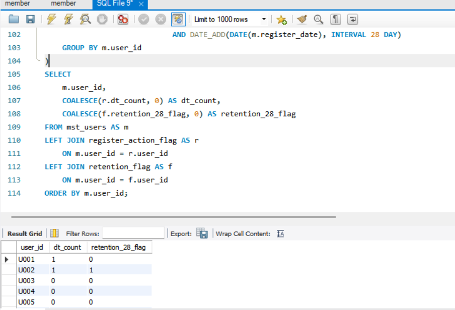

### 2-6 사용자의 잔존율 집계하기 

<!-- 이 부분을 지우고 새롭게 배운 내용을 자유롭게 정리해주세요. -->

```sql
WITH mst_intervals AS (
    SELECT 1 AS interval_month
    UNION ALL SELECT 2
    UNION ALL SELECT 3
    UNION ALL SELECT 4
    UNION ALL SELECT 5
    UNION ALL SELECT 6
    UNION ALL SELECT 7
    UNION ALL SELECT 8
    UNION ALL SELECT 9
    UNION ALL SELECT 10
    UNION ALL SELECT 11
    UNION ALL SELECT 12
),
mst_users_with_index_month AS (
    SELECT
        u.user_id,
        u.register_date,
        DATE_ADD(DATE(u.register_date), INTERVAL i.interval_month MONTH) AS index_date,
        DATE_FORMAT(u.register_date, '%Y-%m') AS register_month,
        DATE_FORMAT(DATE_ADD(DATE(u.register_date), INTERVAL i.interval_month MONTH), '%Y-%m') AS index_month
    FROM mst_users u
    CROSS JOIN mst_intervals i
),
action_log_in_month AS (
    SELECT DISTINCT
        user_id,
        DATE_FORMAT(stamp, '%Y-%m') AS action_month
    FROM action_log
)
SELECT
    u.register_month,
    u.index_month,
    SUM(CASE WHEN a.action_month IS NOT NULL THEN 1 ELSE 0 END) AS users,
    AVG(CASE WHEN a.action_month IS NOT NULL THEN 100.0 ELSE 0.0 END) AS retention_rate
FROM mst_users_with_index_month u
LEFT JOIN action_log_in_month a
    ON u.user_id = a.user_id
   AND u.index_month = a.action_month
GROUP BY
    u.register_month,
    u.index_month
ORDER BY
    u.register_month,
    u.index_month;
```

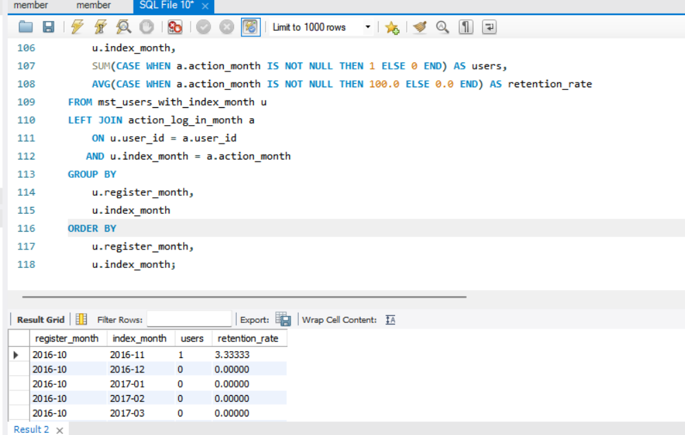

### 2-7 방문 빈도를 기반으로 사용자 속성을 정의하고 집계하기

<!-- 이 부분을 지우고 새롭게 배운 내용을 자유롭게 정리해주세요. -->

```sql
WITH monthly_user_action AS (
    SELECT DISTINCT
        u.user_id,
        DATE_FORMAT(u.register_date, '%Y-%m') AS register_month,
        DATE_FORMAT(l.stamp, '%Y-%m') AS action_month,
        DATE_FORMAT(DATE_SUB(DATE(l.stamp), INTERVAL 1 MONTH), '%Y-%m') AS action_month_priv
    FROM mst_users AS u
    JOIN action_log AS l
        ON u.user_id = l.user_id
),
monthly_user_with_type AS (
    SELECT
        action_month,
        user_id,
        CASE
            WHEN register_month = action_month THEN 'new_user'
            WHEN action_month_priv = LAG(action_month) OVER (
                PARTITION BY user_id
                ORDER BY action_month
            ) THEN 'repeat_user'
            ELSE 'come_back_user'
        END AS c,
        action_month_priv
    FROM monthly_user_action
)
SELECT
    action_month,
    COUNT(user_id) AS mau,
    COUNT(CASE WHEN c = 'new_user' THEN 1 END) AS new_users,
    COUNT(CASE WHEN c = 'repeat_user' THEN 1 END) AS repeat_users,
    COUNT(CASE WHEN c = 'come_back_user' THEN 1 END) AS come_back_users
FROM monthly_user_with_type
GROUP BY action_month
ORDER BY action_month;
```

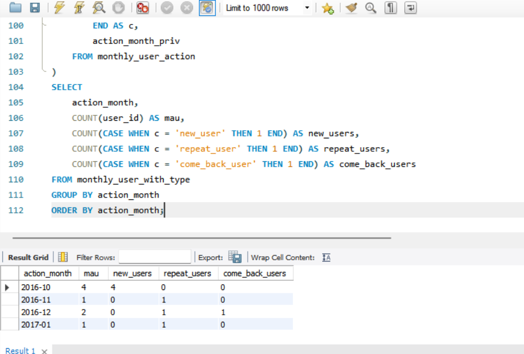

### 2-8 방문 종류를 기반으로 성장지수 집계하기 

<!-- 이 부분을 지우고 새롭게 배운 내용을 자유롭게 정리해주세요. -->

```sql
WITH RECURSIVE
date_bounds AS (
    SELECT
        LEAST(
            COALESCE((SELECT MIN(DATE(register_date)) FROM mst_users), '9999-12-31'),
            COALESCE((SELECT MIN(DATE(stamp)) FROM action_log), '9999-12-31')
        ) AS start_date,
        GREATEST(
            COALESCE((SELECT MAX(DATE(withdraw_date)) FROM mst_users), '1000-01-01'),
            COALESCE((SELECT MAX(DATE(register_date)) FROM mst_users), '1000-01-01'),
            COALESCE((SELECT MAX(DATE(stamp)) FROM action_log), '1000-01-01')
        ) AS end_date
),
mst_calendar AS (
    SELECT start_date AS dt
    FROM date_bounds
    UNION ALL
    SELECT DATE_ADD(dt, INTERVAL 1 DAY)
    FROM mst_calendar, date_bounds
    WHERE dt < end_date
),
unique_action_log AS (
    SELECT DISTINCT
        user_id,
        DATE(stamp) AS action_date
    FROM action_log
),
target_date_with_user AS (
    SELECT
        c.dt AS target_date,
        u.user_id,
        DATE(u.register_date) AS register_date,
        DATE(u.withdraw_date) AS withdraw_date
    FROM mst_users AS u
    CROSS JOIN mst_calendar AS c
),
user_status_log AS (
    SELECT
        u.target_date,
        u.user_id,
        u.register_date,
        u.withdraw_date,
        a.action_date,
        CASE WHEN u.register_date = a.action_date THEN 1 ELSE 0 END AS is_new,
        CASE WHEN u.withdraw_date = a.action_date THEN 1 ELSE 0 END AS is_exit,
        CASE WHEN u.target_date = a.action_date THEN 1 ELSE 0 END AS is_access,
        LAG(CASE WHEN u.target_date = a.action_date THEN 1 ELSE 0 END)
            OVER (
                PARTITION BY u.user_id
                ORDER BY u.target_date
            ) AS was_access
    FROM target_date_with_user AS u
    LEFT JOIN unique_action_log AS a
        ON u.user_id = a.user_id
       AND u.target_date = a.action_date
    WHERE u.register_date <= u.target_date
      AND (
            u.withdraw_date IS NULL
         OR u.target_date <= u.withdraw_date
      )
),
user_growth_index AS (
    SELECT
        *,
        CASE
            WHEN is_new + is_exit = 1 THEN
                CASE
                    WHEN is_new = 1 THEN 'signup'
                    WHEN is_exit = 1 THEN 'exit'
                END
            WHEN is_new + is_exit = 0 THEN
                CASE
                    WHEN COALESCE(was_access, 0) = 0 AND is_access = 1 THEN 'reactivation'
                    WHEN COALESCE(was_access, 0) = 1 AND is_access = 0 THEN 'deactivation'
                END
        END AS growth_index
    FROM user_status_log
)
SELECT
    target_date,
    SUM(CASE WHEN growth_index = 'signup' THEN 1 ELSE 0 END) AS signup,
    SUM(CASE WHEN growth_index = 'reactivation' THEN 1 ELSE 0 END) AS reactivation,
    SUM(CASE WHEN growth_index = 'deactivation' THEN -1 ELSE 0 END) AS deactivation,
    SUM(CASE WHEN growth_index = 'exit' THEN -1 ELSE 0 END) AS 'exit',
    SUM(
        CASE
            WHEN growth_index = 'signup' THEN 1
            WHEN growth_index = 'reactivation' THEN 1
            WHEN growth_index = 'deactivation' THEN -1
            WHEN growth_index = 'exit' THEN -1
            ELSE 0
        END
    ) AS growth_index
FROM user_growth_index
GROUP BY target_date
ORDER BY target_date;
```

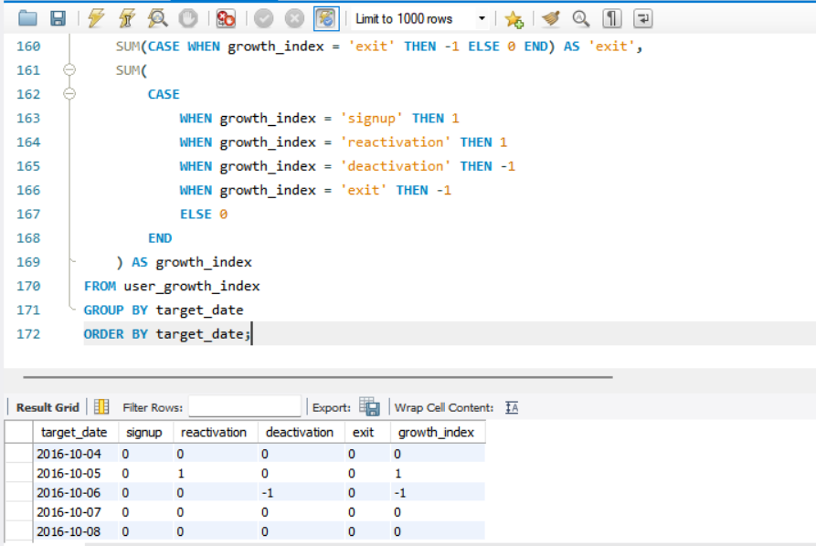

### 2-9 지표 개선 방법 익히기 

### 기본 접근 방법
1. 개선하고 싶은 지표 설정
2. 지표에 영향을 줄 것 같은 사용자 행동 정의
3. 해당 행동 여부에 따라 지표 차이 비교

### 핵심 포인트
- 단순 분석이 아니라 **행동 → 지표 영향 확인**이 중요
- 유의미한 차이가 있는 행동이 개선 포인트
- 사용자 특성보다 **행동 기반 분석이 더 중요**

```sql
여기에 코드를 적어주세요.
```

<!-- 이 부분을 지우고 실행 결과 화면을 제출해주세요. -->


## 3. 시계열에 따른 사용자의 개별적인 행동 분석하기 

### 3-1 사용자의 액션 간격 집계하기

<!-- 이 부분을 지우고 새롭게 배운 내용을 자유롭게 정리해주세요. -->

```sql
WITH reservations AS (
    SELECT 1 AS reservation_id, DATE('2016-09-01') AS register_date, DATE('2016-10-01') AS visit_date, 3 AS days
    UNION ALL SELECT 2, DATE('2016-09-20'), DATE('2016-10-01'), 2
    UNION ALL SELECT 3, DATE('2016-09-30'), DATE('2016-11-20'), 2
    UNION ALL SELECT 4, DATE('2016-10-01'), DATE('2017-01-03'), 2
    UNION ALL SELECT 5, DATE('2016-11-01'), DATE('2016-12-28'), 3
)
SELECT
    reservation_id,
    register_date,
    visit_date,
    DATEDIFF(visit_date, register_date) AS lead_time
FROM reservations;
```
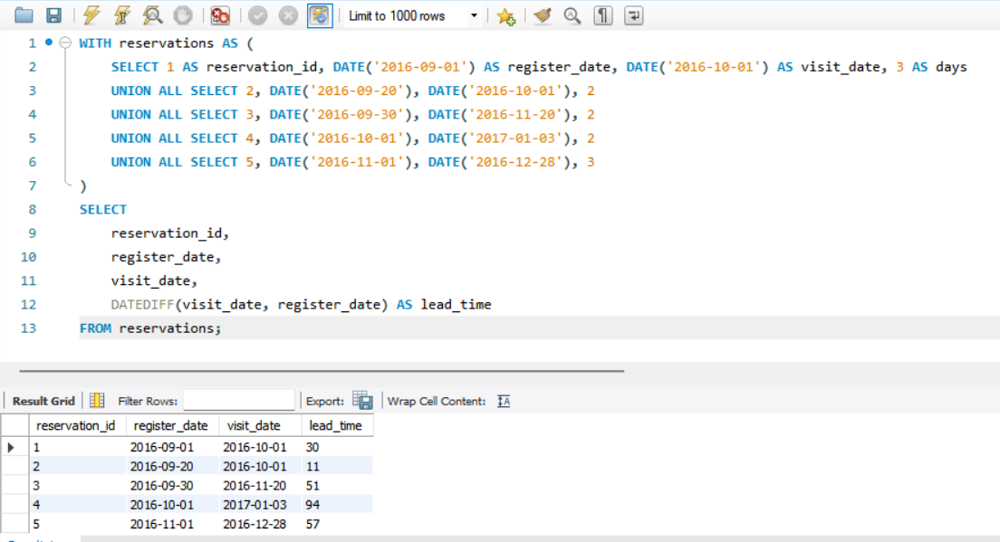

### 3-2 카트 추가 후에 구매했는지 파악하기 

<!-- 이 부분을 지우고 새롭게 배운 내용을 자유롭게 정리해주세요. -->

```sql
WITH row_action_log AS (
    SELECT
        dt,
        user_id,
        action,
        SUBSTRING_INDEX(SUBSTRING_INDEX(products, ',', numbers.n), ',', -1) AS product_id,
        stamp
    FROM action_log
    JOIN (
        SELECT 1 AS n UNION ALL SELECT 2 UNION ALL SELECT 3 UNION ALL SELECT 4 UNION ALL SELECT 5
    ) numbers
    ON CHAR_LENGTH(products) - CHAR_LENGTH(REPLACE(products, ',', '')) >= numbers.n - 1
),
action_time_stats AS (
    SELECT
        user_id,
        product_id,
        MIN(CASE WHEN action = 'add_cart' THEN dt END) AS dt,
        MIN(CASE WHEN action = 'add_cart' THEN stamp END) AS add_cart_time,
        MIN(CASE WHEN action = 'purchase' THEN stamp END) AS purchase_time,
        TIMESTAMPDIFF(
            SECOND,
            MIN(CASE WHEN action = 'add_cart' THEN stamp END),
            MIN(CASE WHEN action = 'purchase' THEN stamp END)
        ) AS lead_time
    FROM row_action_log
    GROUP BY user_id, product_id
),
purchase_lead_time_flag AS (
    SELECT
        user_id,
        product_id,
        dt,
        CASE WHEN lead_time <= 1 * 60 * 60 THEN 1 ELSE 0 END AS purchase_1_hour,
        CASE WHEN lead_time <= 6 * 60 * 60 THEN 1 ELSE 0 END AS purchase_6_hours,
        CASE WHEN lead_time <= 24 * 60 * 60 THEN 1 ELSE 0 END AS purchase_24_hours,
        CASE WHEN lead_time <= 48 * 60 * 60 THEN 1 ELSE 0 END AS purchase_48_hours,
        CASE
            WHEN lead_time IS NULL OR NOT (lead_time <= 48 * 60 * 60) THEN 1
            ELSE 0
        END AS not_purchase
    FROM action_time_stats
)
SELECT
    dt,
    COUNT(*) AS add_cart,
    SUM(purchase_1_hour) AS purchase_1_hour,
    AVG(purchase_1_hour) AS purchase_1_hour_rate,
    SUM(purchase_6_hours) AS purchase_6_hours,
    AVG(purchase_6_hours) AS purchase_6_hours_rate,
    SUM(purchase_24_hours) AS purchase_24_hours,
    AVG(purchase_24_hours) AS purchase_24_hours_rate,
    SUM(purchase_48_hours) AS purchase_48_hours,
    AVG(purchase_48_hours) AS purchase_48_hours_rate,
    SUM(not_purchase) AS not_purchase,
    AVG(not_purchase) AS not_purchase_rate
FROM purchase_lead_time_flag
GROUP BY dt;
```

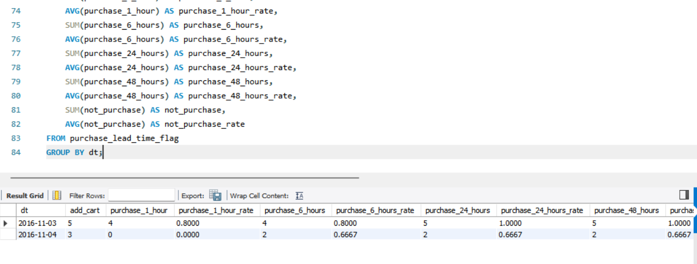

### 3-3 등록으로부터의 매출을 날짜별로 집계하기 

<!-- 이 부분을 지우고 새롭게 배운 내용을 자유롭게 정리해주세요. -->

```sql
WITH index_intervals AS (
    SELECT '30 day sales amount' AS index_name, 0 AS interval_begin_date, 30 AS interval_end_date
    UNION ALL
    SELECT '45 day sales amount', 0, 45
    UNION ALL
    SELECT '60 day sales amount', 0, 60
),
mst_users_with_base_date AS (
    SELECT
        user_id,
        register_date AS base_date
    FROM mst_users
),
purchase_log_with_index_date AS (
    SELECT
        u.user_id,
        u.base_date,
        DATE(p.stamp) AS action_date,
        MAX(DATE(p.stamp)) OVER () AS latest_date,
        DATE_FORMAT(u.base_date, '%Y-%m') AS month,
        i.index_name,
        DATE_ADD(DATE(u.base_date), INTERVAL i.interval_begin_date DAY) AS index_begin_date,
        DATE_ADD(DATE(u.base_date), INTERVAL i.interval_end_date DAY) AS index_end_date
    FROM mst_users_with_base_date AS u
    LEFT JOIN action_log AS p
        ON u.user_id = p.user_id
       AND p.action = 'purchase'
    CROSS JOIN index_intervals AS i
)
SELECT *
FROM purchase_log_with_index_date;
```
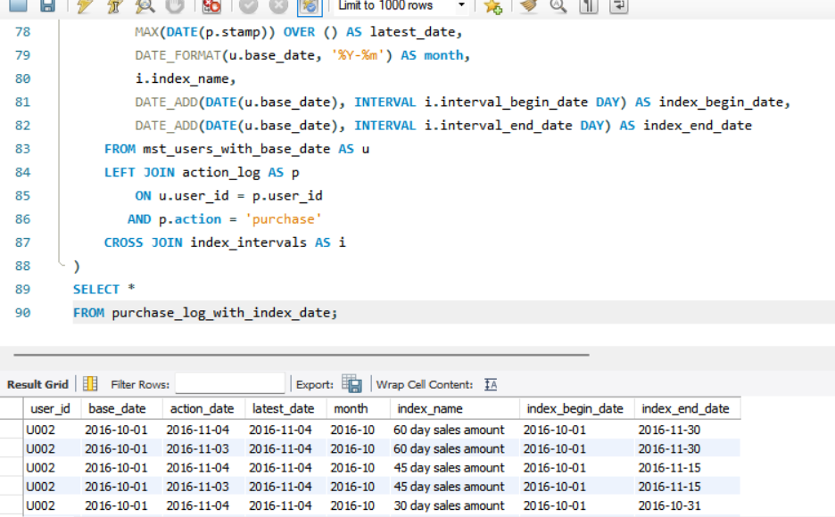


### 🎉 수고하셨습니다.
