# SQL_MASTER 6주차 정규과제

📌SQL MASTER 정규과제는 매주 정해진 분량의 『*데이터 분석을 위한 SQL 레시피*』 를 읽고 학습하는 것입니다. 이번 주는 아래의 **SQL_MASTER_6th_TIL**에 나열된 분량을 읽고 공부하시면 됩니다.

아래 실습을 수행하며 학습 내용을 직접 적용해보세요. 단순히 결과를 재현하는 것이 아니라, SQL을 직접 작성하는 과정에서 개념을 스스로 정리하는 것이 중요합니다.

필요한 경우 교재와 추가 자료를 참고하여 이해를 보완하시기 바랍니다.

## SQL_MASTER_6th_TIL

### 6장 웹사이트에서의 행동을 파악하는 데이터 추출하기
#### 1. 사이트 전체의 특징/경향 찾기
#### 2. 사이트 내의 사용자 행동 파악하기
#### 3. 입력 양식 최적화하기 


## Study Schedule

| 주차  | 공부 범위     | 완료 여부 |
| ----- | ------------- | --------- |
| 1주차 | p.20~50    | ✅         |
| 2주차 | p.52~136   | ✅         |
| 3주차 | p.138~184  | ✅         |
| 4주차 | p.186~232 | ✅         |
| 5주차 | p.233~321 | ✅         |
| 6주차 | p.324~406 | ✅         |
| 7주차 | p.408~464 | 🍽️         |

<br>

<!-- 여기까진 그대로 둬 주세요-->


# 실습

## 0. 실습 규칙

1. 샘플 데이터 생성 코드는 **07_SQL_MASTER_Template/src** 경로에 장별로 정리되어 있습니다.
2. 아래 목차에 맞춰 해당 코드를 실행하여 샘플 데이터를 생성한 후, 각 장에서 요구하는 쿼리를 직접 작성해보시기 바랍니다.
3. 작성한 쿼리의 **실행 결과 화면도 함께 제출**해 주세요.
4. 단순히 교재의 예시 코드를 그대로 작성하는 것이 아니라, **제시된 로직을 충분히 이해한 뒤 교재를 보지 않고 스스로 쿼리를 구성**해보는 것을 권장합니다.
5. 교재 예시는 PostgreSQL, Hive, BigQuery 등 다양한 DBMS 기준으로 제시되어 있기 때문에, **MySQL이 아닌 다른 SQL 환경을 사용하여 실습을 진행해도 무방합니다.**
6. 다만, 사용 중인 DBMS에 맞는 문법으로 적절히 변환하여 작성하시기 바랍니다.

## 1. 사이트 전체의 특징/경향 찾기

### 1-1 날짜별 방문자 수 / 방문 횟수 / 페이지 뷰 집계하기

<!-- 이 부분을 지우고 새롭게 배운 내용을 자유롭게 정리해주세요. -->

```sql
SELECT
    SUBSTRING(stamp, 1, 10) AS dt,
    COUNT(DISTINCT long_session) AS access_users,
    COUNT(DISTINCT short_session) AS access_count,
    COUNT(*) AS page_view,
    1.0 * COUNT(*) / NULLIF(COUNT(DISTINCT long_session), 0) AS pv_per_user
FROM access_log
GROUP BY dt
ORDER BY dt;
```

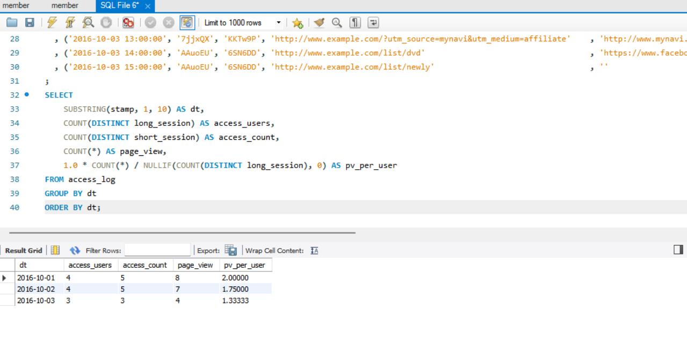

### 1-2 페이지별 쿠키 / 방문 횟수 / 페이지 뷰 집계하기

<!-- 이 부분을 지우고 새롭게 배운 내용을 자유롭게 정리해주세요. -->

```sql
WITH access_log_with_path AS (
    SELECT
        *,
        TRIM(BOTH '/' FROM url) AS url_path
    FROM access_log
),
access_log_with_split_path AS (
    SELECT
        *,
        SUBSTRING_INDEX(url_path, '/', 1) AS path1,
        SUBSTRING_INDEX(
            SUBSTRING_INDEX(url_path, '/', 2),
            '/',
            -1
        ) AS path2
    FROM access_log_with_path
),
access_log_with_page_name AS (
    SELECT
        *,
        CASE
            WHEN path1 = 'list' THEN
                CASE
                    WHEN path2 = 'newly' THEN 'newly_list'
                    ELSE 'category_list'
                END
            ELSE url_path
        END AS page_name
    FROM access_log_with_split_path
)
SELECT
    page_name,
    COUNT(DISTINCT short_session) AS access_count,
    COUNT(DISTINCT long_session) AS access_users,
    COUNT(*) AS page_view
FROM access_log_with_page_name
GROUP BY page_name
ORDER BY page_name;
```

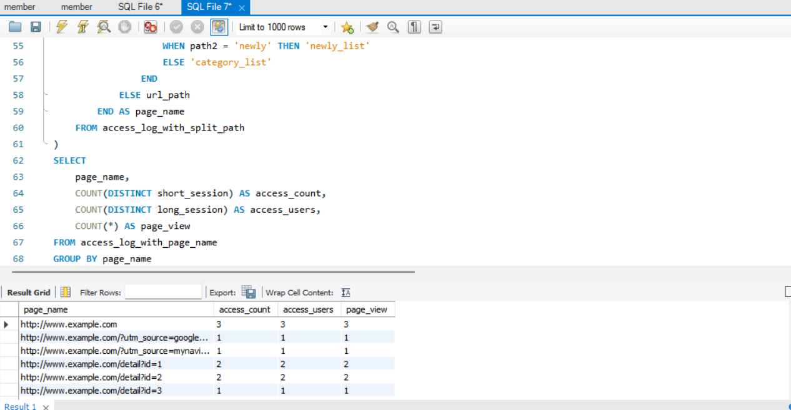

### 1-3 유입원별로 방문 횟수 또는 CVR 집계하기

<!-- 이 부분을 지우고 새롭게 배운 내용을 자유롭게 정리해주세요. -->

```sql
WITH access_log_with_parse_info AS (
    SELECT
        *,
        SUBSTRING_INDEX(SUBSTRING_INDEX(url, '://', -1), '/', 1) AS url_domain,
        CASE
            WHEN url LIKE '%utm_source=%'
            THEN SUBSTRING_INDEX(SUBSTRING_INDEX(url, 'utm_source=', -1), '&', 1)
            ELSE ''
        END AS url_utm_source,
        CASE
            WHEN url LIKE '%utm_medium=%'
            THEN SUBSTRING_INDEX(SUBSTRING_INDEX(url, 'utm_medium=', -1), '&', 1)
            ELSE ''
        END AS url_utm_medium,
        SUBSTRING_INDEX(SUBSTRING_INDEX(referrer, '://', -1), '/', 1) AS referrer_domain
    FROM access_log
),
access_log_with_via_info AS (
    SELECT
        *,
        ROW_NUMBER() OVER (ORDER BY stamp) AS log_id,
        CASE
            WHEN url_utm_source <> '' AND url_utm_medium <> ''
                THEN CONCAT(url_utm_source, '-', url_utm_medium)
            WHEN referrer_domain IN ('search.yahoo.co.jp', 'www.google.co.jp')
                THEN 'search'
            WHEN referrer_domain IN ('twitter.com', 'www.facebook.com')
                THEN 'social'
            ELSE 'other'
        END AS via
    FROM access_log_with_parse_info
    WHERE COALESCE(referrer_domain, '') NOT IN ('', url_domain)
)
SELECT
    via,
    COUNT(*) AS access_count
FROM access_log_with_via_info
GROUP BY via
ORDER BY access_count DESC;
```

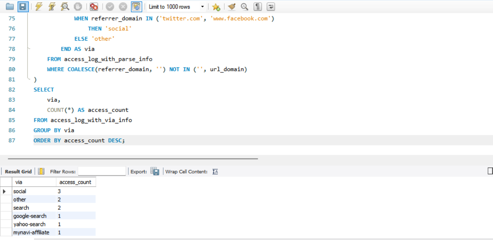 

### 1-4 접근 요일,시간대 파악하기

<!-- 이 부분을 지우고 새롭게 배운 내용을 자유롭게 정리해주세요. -->

```sql
WITH access_log_with_dow AS (
    SELECT
        stamp,
        DAYOFWEEK(stamp) - 1 AS dow,
        HOUR(stamp) * 60 * 60
            + MINUTE(stamp) * 60
            + SECOND(stamp) AS whole_seconds,
        30 * 60 AS interval_seconds
    FROM access_log
),
access_log_with_floor_seconds AS (
    SELECT
        stamp,
        dow,
        FLOOR(whole_seconds / interval_seconds) * interval_seconds AS floor_seconds
    FROM access_log_with_dow
),
access_log_with_index AS (
    SELECT
        stamp,
        dow,
        CONCAT(
            LPAD(FLOOR(floor_seconds / (60 * 60)), 2, '0'),
            ':',
            LPAD(FLOOR(MOD(floor_seconds, 60 * 60) / 60), 2, '0'),
            ':',
            LPAD(MOD(floor_seconds, 60), 2, '0')
        ) AS index_time
    FROM access_log_with_floor_seconds
)
SELECT
    index_time,
    COUNT(CASE WHEN dow = 0 THEN 1 END) AS sun,
    COUNT(CASE WHEN dow = 1 THEN 1 END) AS mon,
    COUNT(CASE WHEN dow = 2 THEN 1 END) AS tue,
    COUNT(CASE WHEN dow = 3 THEN 1 END) AS wed,
    COUNT(CASE WHEN dow = 4 THEN 1 END) AS thu,
    COUNT(CASE WHEN dow = 5 THEN 1 END) AS fri,
    COUNT(CASE WHEN dow = 6 THEN 1 END) AS sat
FROM access_log_with_index
GROUP BY index_time
ORDER BY index_time;
```

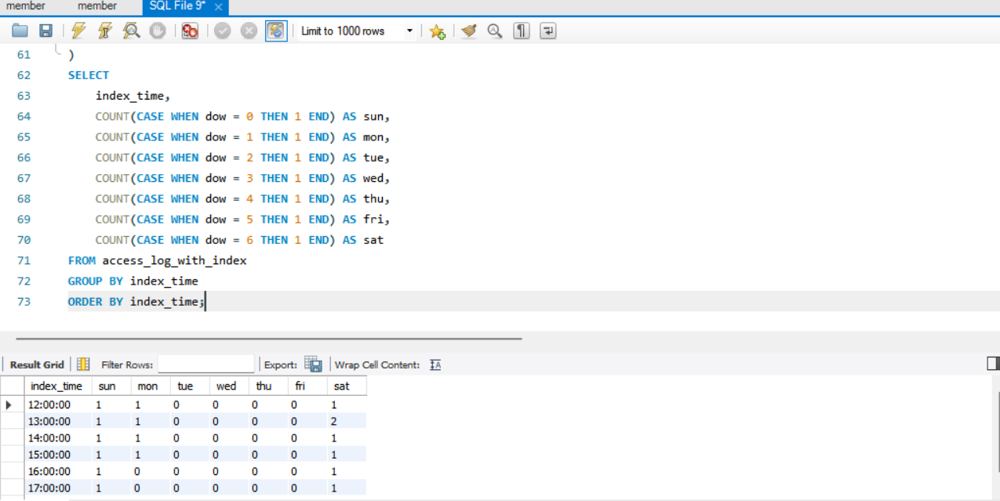

## 2. 사이트 내의 사용자 행동 파악하기 

### 2-1 입구 페이지와 출구 페이지 파악하기

<!-- 이 부분을 지우고 새롭게 배운 내용을 자유롭게 정리해주세요. -->

```sql
WITH activity_log_with_landing_exit AS (
    SELECT
        session,
        path,
        stamp,
        FIRST_VALUE(path) OVER (
            PARTITION BY session
            ORDER BY stamp ASC
            ROWS BETWEEN UNBOUNDED PRECEDING AND UNBOUNDED FOLLOWING
        ) AS landing,
        LAST_VALUE(path) OVER (
            PARTITION BY session
            ORDER BY stamp ASC
            ROWS BETWEEN UNBOUNDED PRECEDING AND UNBOUNDED FOLLOWING
        ) AS `exit`
    FROM activity_log
)
SELECT *
FROM activity_log_with_landing_exit;
```

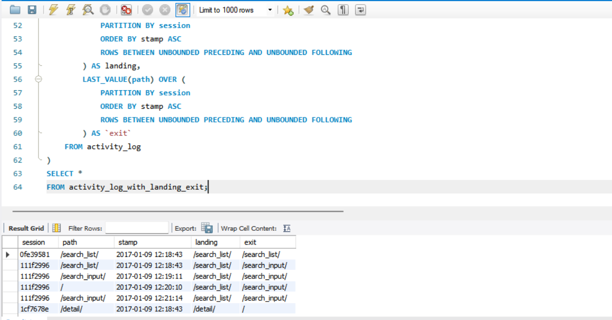

### 2-2 이탈률과 직귀율 계산하기

<!-- 이 부분을 지우고 새롭게 배운 내용을 자유롭게 정리해주세요. -->

```sql
WITH activity_log_with_exit_flag AS (
    SELECT
        *,
        CASE
            WHEN ROW_NUMBER() OVER (
                PARTITION BY session
                ORDER BY stamp DESC
            ) = 1 THEN 1
            ELSE 0
        END AS is_exit
    FROM activity_log
)
SELECT
    path,
    SUM(is_exit) AS exit_count,
    COUNT(1) AS page_view,
    AVG(100.0 * is_exit) AS exit_ratio
FROM activity_log_with_exit_flag
GROUP BY path;여기에 코드를 적어주세요.
```

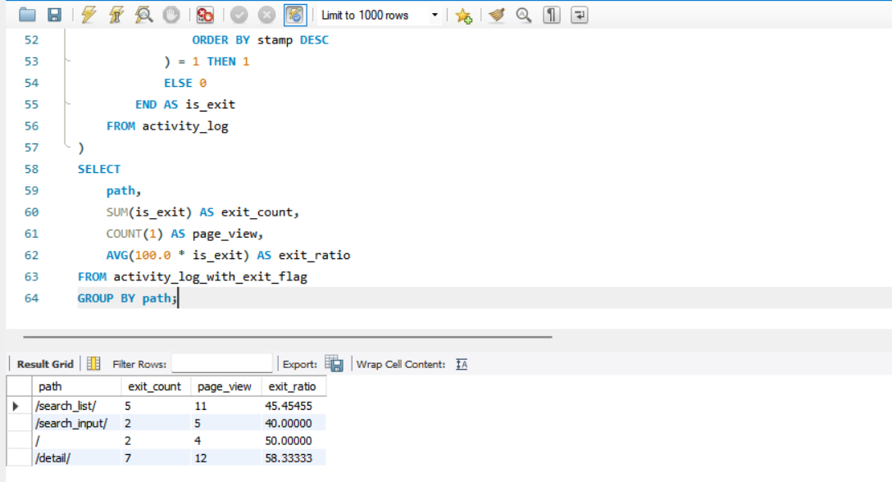

```sql
WITH activity_log_with_landing_bounce_flag AS (
    SELECT
        *,
        CASE
            WHEN ROW_NUMBER() OVER (
                PARTITION BY session
                ORDER BY stamp ASC
            ) = 1 THEN 1
            ELSE 0
        END AS is_landing,
        CASE
            WHEN COUNT(1) OVER (
                PARTITION BY session
            ) = 1 THEN 1
            ELSE 0
        END AS is_bounce
    FROM activity_log
)
SELECT
    path,
    SUM(is_bounce) AS bounce_count,
    SUM(is_landing) AS landing_count,
    AVG(CASE WHEN is_landing = 1 THEN 100.0 * is_bounce END) AS bounce_ratio
FROM activity_log_with_landing_bounce_flag
GROUP BY path;
```

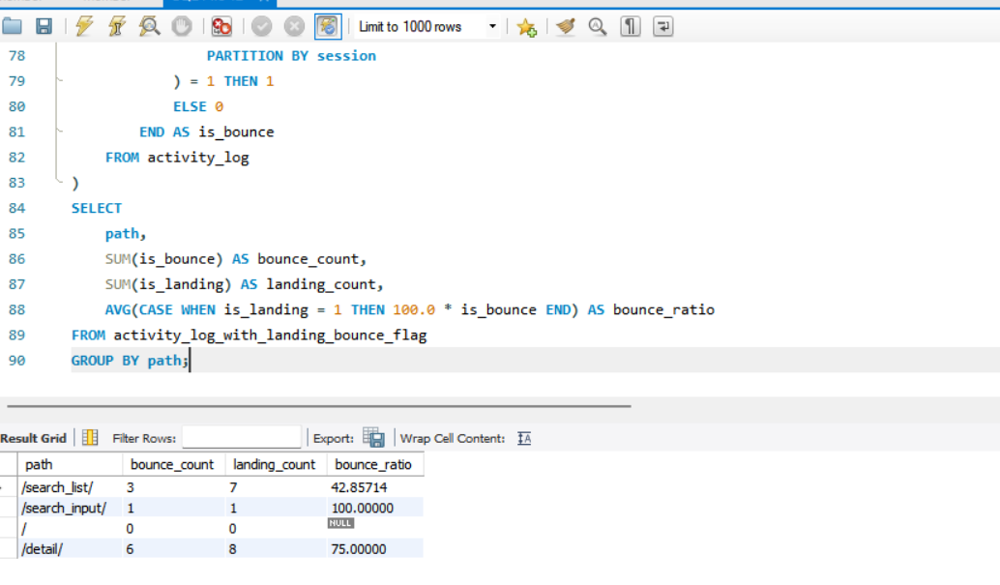

### 2-3 성과로 이어지는 페이지 파악하기 

<!-- 이 부분을 지우고 새롭게 배운 내용을 자유롭게 정리해주세요. -->

```sql
WITH activity_log_with_conversion_flag AS (
    SELECT
        session,
        stamp,
        path,
        SIGN(SUM(CASE WHEN path = '/complete' THEN 1 ELSE 0 END) OVER (
            PARTITION BY session
            ORDER BY stamp DESC
            ROWS BETWEEN UNBOUNDED PRECEDING AND CURRENT ROW
        )) AS has_conversion
    FROM activity_log
)
SELECT
    path,
    COUNT(DISTINCT session) AS sessions,
    SUM(has_conversion) AS conversions,
    1.0 * SUM(has_conversion) / COUNT(DISTINCT session) AS cvr
FROM activity_log_with_conversion_flag
GROUP BY path;
```

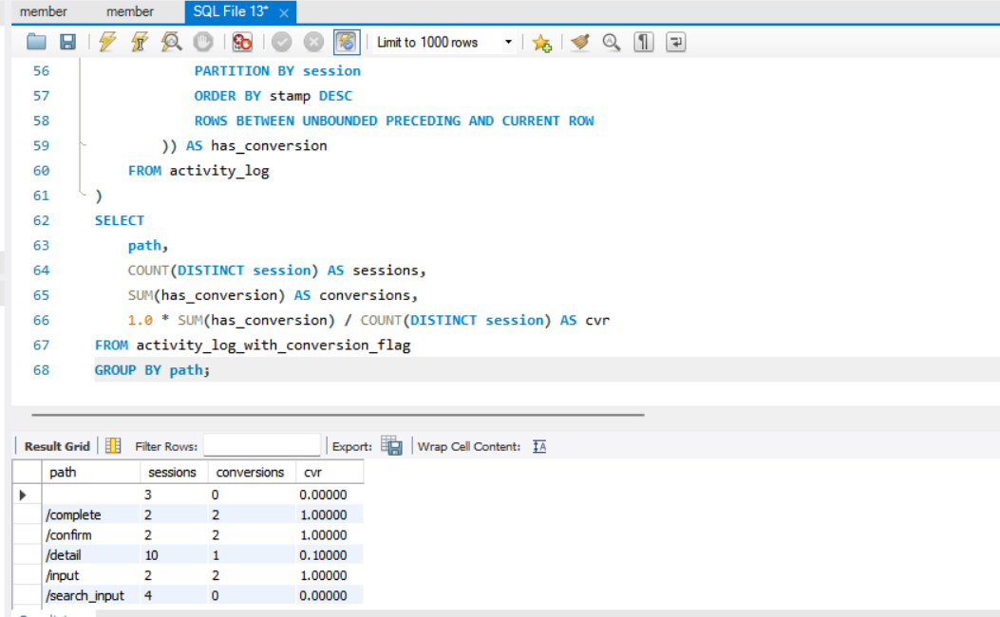

### 2-4 페이지 가치 산출하기 

<!-- 이 부분을 지우고 새롭게 배운 내용을 자유롭게 정리해주세요. -->

```sql
WITH activity_log_with_conversion_flag AS (
    SELECT
        session,
        stamp,
        path,
        SIGN(SUM(CASE WHEN path = '/complete' THEN 1 ELSE 0 END) OVER (
            PARTITION BY session
            ORDER BY stamp DESC
            ROWS BETWEEN UNBOUNDED PRECEDING AND CURRENT ROW
        )) AS has_conversion
    FROM activity_log
),
activity_log_with_conversion_assign AS (
    SELECT
        session,
        stamp,
        path,
        ROW_NUMBER() OVER (PARTITION BY session ORDER BY stamp ASC) AS asc_order,
        ROW_NUMBER() OVER (PARTITION BY session ORDER BY stamp DESC) AS desc_order,
        COUNT(1) OVER (PARTITION BY session) AS page_count,
        1000.0 / COUNT(1) OVER (PARTITION BY session) AS fair_assign,
        CASE
            WHEN ROW_NUMBER() OVER (PARTITION BY session ORDER BY stamp ASC) = 1 THEN 1000.0
            ELSE 0.0
        END AS first_assign,
        CASE
            WHEN ROW_NUMBER() OVER (PARTITION BY session ORDER BY stamp DESC) = 1 THEN 1000.0
            ELSE 0.0
        END AS last_assign,
        1000.0
            * ROW_NUMBER() OVER (PARTITION BY session ORDER BY stamp ASC)
            / (
                COUNT(1) OVER (PARTITION BY session)
                * (COUNT(1) OVER (PARTITION BY session) + 1)
                / 2
            ) AS decrease_assign,
        1000.0
            * ROW_NUMBER() OVER (PARTITION BY session ORDER BY stamp DESC)
            / (
                COUNT(1) OVER (PARTITION BY session)
                * (COUNT(1) OVER (PARTITION BY session) + 1)
                / 2
            ) AS increase_assign
    FROM activity_log_with_conversion_flag
    WHERE has_conversion = 1
      AND path NOT IN ('/input', '/confirm', '/complete')
)
SELECT
    session,
    asc_order,
    path,
    fair_assign AS fair_a,
    first_assign AS first_a,
    last_assign AS last_a,
    decrease_assign AS dec_a,
    increase_assign AS inc_a
FROM activity_log_with_conversion_assign
ORDER BY session, asc_order;
```

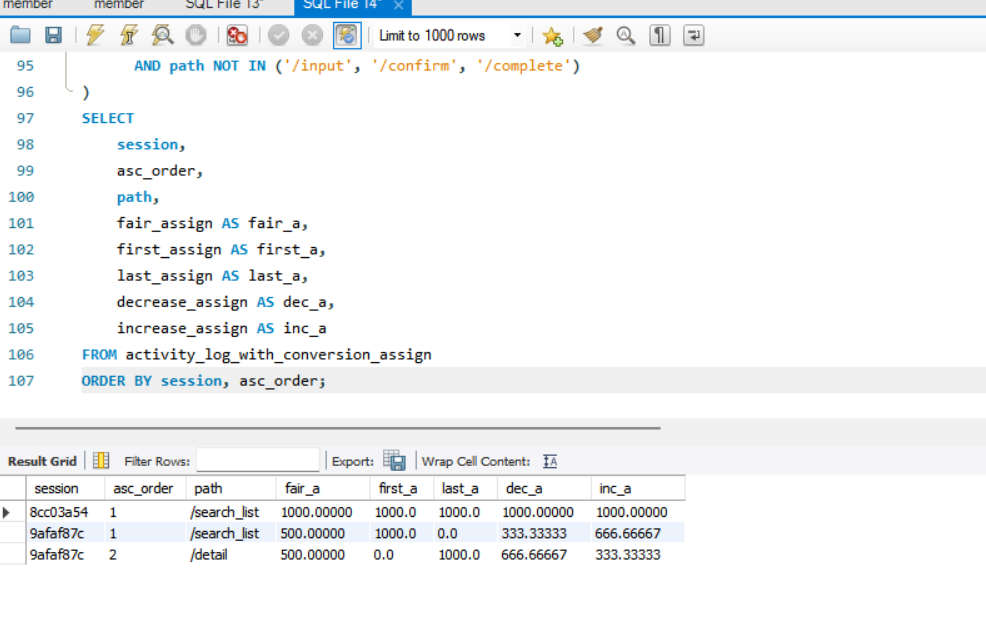

### 2-5 검색 조건들의 사용자 행동 가시화하기 

<!-- 이 부분을 지우고 새롭게 배운 내용을 자유롭게 정리해주세요. -->

```sql
WITH activity_log_with_session_click_conversion_flag AS (
    SELECT
        session,
        stamp,
        path,
        search_type,
        SIGN(SUM(CASE WHEN path = '/detail' THEN 1 ELSE 0 END) OVER (
            PARTITION BY session
            ORDER BY stamp DESC
            ROWS BETWEEN UNBOUNDED PRECEDING AND CURRENT ROW
        )) AS has_session_click,
        SIGN(SUM(CASE WHEN path = '/complete' THEN 1 ELSE 0 END) OVER (
            PARTITION BY session
            ORDER BY stamp DESC
            ROWS BETWEEN UNBOUNDED PRECEDING AND CURRENT ROW
        )) AS has_session_conversion
    FROM activity_log
)
SELECT
    session,
    stamp,
    path,
    search_type,
    has_session_click AS click,
    has_session_conversion AS cnv
FROM activity_log_with_session_click_conversion_flag
ORDER BY session, stamp;
```

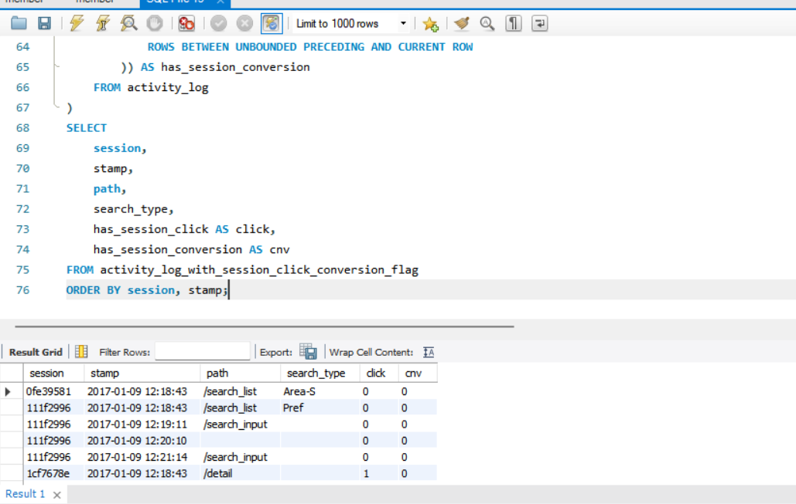

```sql
WITH activity_log_with_session_click_conversion_flag AS (
    SELECT
        session,
        stamp,
        path,
        search_type,
        CASE
            WHEN LAG(path) OVER (
                PARTITION BY session
                ORDER BY stamp DESC
            ) = '/detail' THEN 1
            ELSE 0
        END AS has_session_click,
        SIGN(SUM(CASE WHEN path = '/complete' THEN 1 ELSE 0 END) OVER (
            PARTITION BY session
            ORDER BY stamp DESC
            ROWS BETWEEN UNBOUNDED PRECEDING AND CURRENT ROW
        )) AS has_session_conversion
    FROM activity_log
)
SELECT
    session,
    stamp,
    path,
    search_type,
    has_session_click AS click,
    has_session_conversion AS cnv
FROM activity_log_with_session_click_conversion_flag
ORDER BY session, stamp;
```

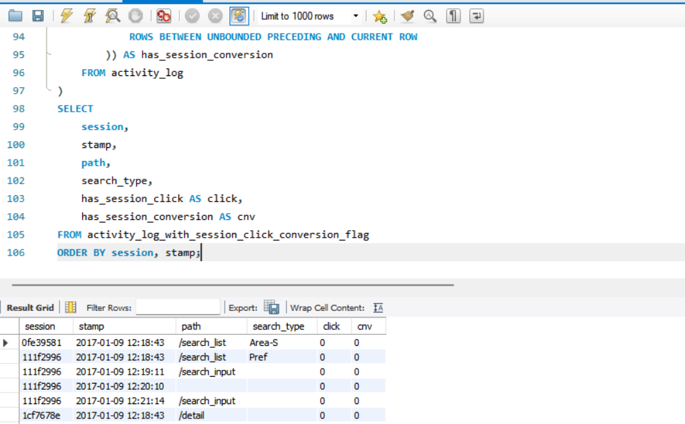

### 2-6 폴아웃 리포트를 사용해 사용자 회유를 가시화하기 

<!-- 이 부분을 지우고 새롭게 배운 내용을 자유롭게 정리해주세요. -->

```sql
여기에 코드를 적어주세요.WITH mst_fallout_step AS (
    SELECT 1 AS step, '/' AS path
    UNION ALL SELECT 2, '/search_list'
    UNION ALL SELECT 3, '/detail'
    UNION ALL SELECT 4, '/input'
    UNION ALL SELECT 5, '/complete'
),
activity_log_with_fallout_step AS (
    SELECT
        l.session,
        m.step,
        m.path,
        MAX(l.stamp) AS max_stamp,
        MIN(l.stamp) AS min_stamp
    FROM mst_fallout_step AS m
    JOIN activity_log AS l
        ON m.path = l.path
    GROUP BY
        l.session,
        m.step,
        m.path
),
activity_log_with_mod_fallout_step AS (
    SELECT
        session,
        step,
        path,
        max_stamp,
        LAG(min_stamp) OVER (
            PARTITION BY session
            ORDER BY step
        ) AS lag_min_stamp,
        MIN(step) OVER (
            PARTITION BY session
        ) AS min_step,
        COUNT(1) OVER (
            PARTITION BY session
            ORDER BY step
            ROWS BETWEEN UNBOUNDED PRECEDING AND CURRENT ROW
        ) AS cum_count
    FROM activity_log_with_fallout_step
)
SELECT *
FROM activity_log_with_mod_fallout_step
ORDER BY session, step;
```

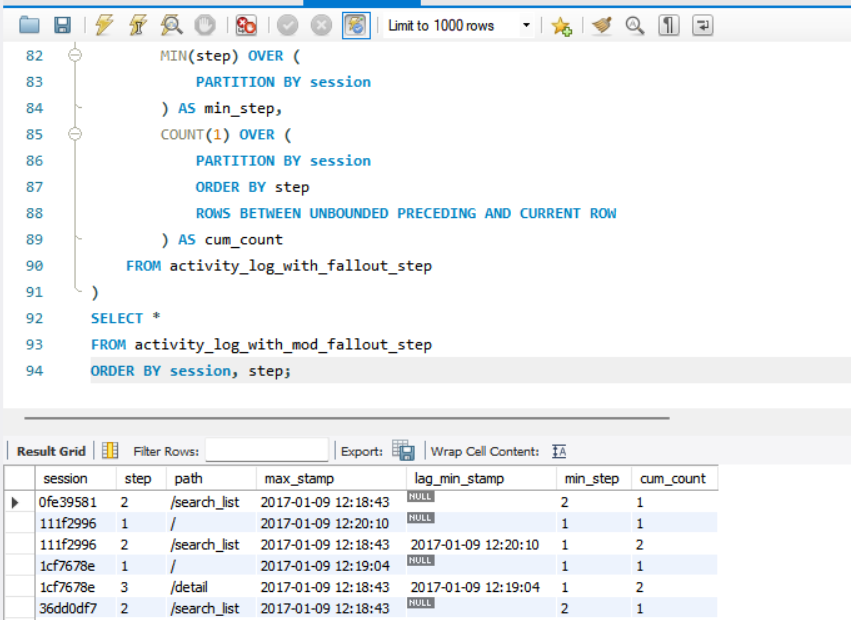

### 2-7 사이트 내부에서 사용자 흐름 파악하기 

<!-- 이 부분을 지우고 새롭게 배운 내용을 자유롭게 정리해주세요. -->

```sql
WITH activity_log_with_lead_path AS (
    SELECT
        session,
        stamp,
        path AS path0,
        LEAD(path, 1) OVER (
            PARTITION BY session
            ORDER BY stamp ASC
        ) AS path1,
        LEAD(path, 2) OVER (
            PARTITION BY session
            ORDER BY stamp ASC
        ) AS path2
    FROM activity_log
),
raw_user_flow AS (
    SELECT
        path0,
        SUM(COUNT(1)) OVER () AS count0,
        COALESCE(path1, 'NULL') AS path1,
        SUM(COUNT(1)) OVER (
            PARTITION BY path0, path1
        ) AS count1,
        COALESCE(path2, 'NULL') AS path2,
        COUNT(1) AS count2
    FROM activity_log_with_lead_path
    WHERE path0 = '/detail'
    GROUP BY
        path0,
        path1,
        path2
)
SELECT
    path0,
    count0,
    path1,
    count1,
    100.0 * count1 / count0 AS rate1,
    path2,
    count2,
    100.0 * count2 / count1 AS rate2
FROM raw_user_flow
ORDER BY count1 DESC, count2 DESC;
```

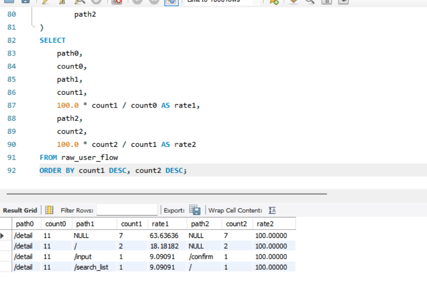

### 2-8 페이지 완독률 집계하기 

<!-- 이 부분을 지우고 새롭게 배운 내용을 자유롭게 정리해주세요. -->

```sql
SELECT
    url,
    action,
    COUNT(1) AS count,
    100.0
        * COUNT(1)
        / SUM(CASE WHEN action = 'view' THEN 1 ELSE 0 END)
            OVER (PARTITION BY url)
    AS action_per_view
FROM read_log
GROUP BY url, action
ORDER BY url, count DESC;
```

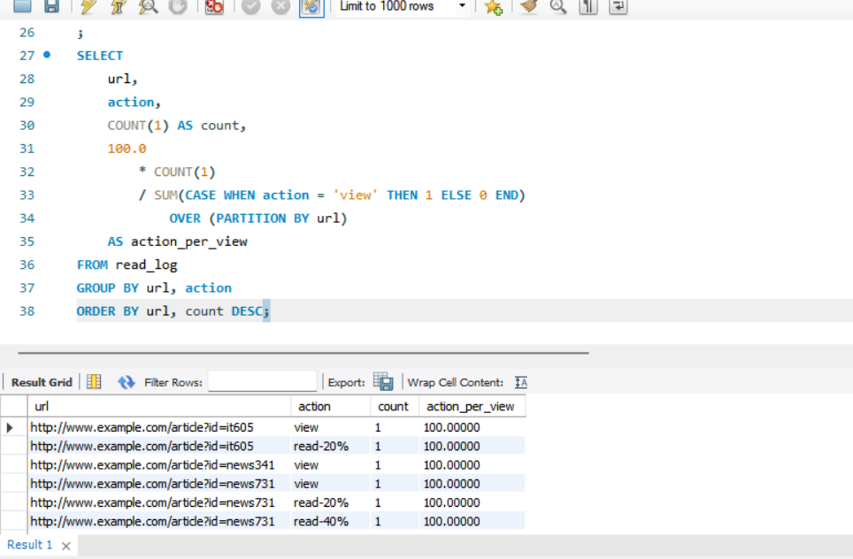

### 2-9 사용자 행동 전체를 시각화하기 

### 1. 개별 지표만 보면 전체 흐름을 놓칠 수 있음
- 접근 분석 도구의 리포트는 대부분 특정 지점(point) 정보만 제공
- 페이지 이탈률, 클릭 수 같은 단일 지표만 보면 원인을 잘못 해석할 가능성이 큼
- 중요한 것은 **사용자의 전체 이동 흐름(flow)** 을 보는 것

---

### 2. 조감도(Funnel/Flow Map)의 필요성
- 사용자 유입 → 페이지 이동 → 검색 → 회원가입 → 구매 등
  전체 경로를 연결해서 시각화해야 함
- 이를 통해:
  - 어디서 사용자가 많이 이탈하는지
  - 어떤 단계가 병목인지
  - 어떤 개선이 실제 성과로 이어지는지
  파악 가능

---

## 조감도 활용 효과

### 문제 원인 발견
예시:
- 최상위 페이지 이탈률이 높아 페이지를 개선했지만
- 실제 문제는 입력 양식 단계에서 사용자들이 많이 이탈하는 것이었음

→ 즉, 부분 최적화보다 전체 흐름 분석이 중요

---

### 서비스 운영 방향 제시
조감도를 통해:
- 집중적으로 개선해야 할 영역
- 굳이 리소스를 투입하지 않아도 되는 영역
- 사용자 행동 패턴
을 한눈에 확인 가능

---

## 서비스 형태별 조감도 활용

### 웹사이트 외에도 활용 가능
- 플랫폼 서비스
- 앱 서비스
- 다양한 사용자 흐름 기반 서비스

모두 조감도 방식으로 전체 구조를 파악 가능

---

## 좋은 조감도의 조건
- 누구나 쉽게 이해 가능해야 함
- 사용자 흐름이 명확하게 보여야 함
- 핵심 문제 구간이 직관적으로 드러나야 함

→ 단순 데이터 나열이 아니라 “의사결정을 위한 시각화”가 중요


```sql
여기에 코드를 적어주세요.
```

<!-- 이 부분을 지우고 실행 결과 화면을 제출해주세요. -->

## 3. 입력 양식 최적화하기 

### 3-1 오류율 집계하기 

<!-- 이 부분을 지우고 새롭게 배운 내용을 자유롭게 정리해주세요. -->

```sql
SELECT
    COUNT(*) AS confirm_count,
    SUM(CASE WHEN status = 'error' THEN 1 ELSE 0 END) AS error_count,
    AVG(CASE WHEN status = 'error' THEN 1.0 ELSE 0.0 END) AS error_rate,
    SUM(CASE WHEN status = 'error' THEN 1.0 ELSE 0.0 END)
        / COUNT(DISTINCT session) AS error_per_user
FROM form_log
WHERE path = '/regist/confirm';
```

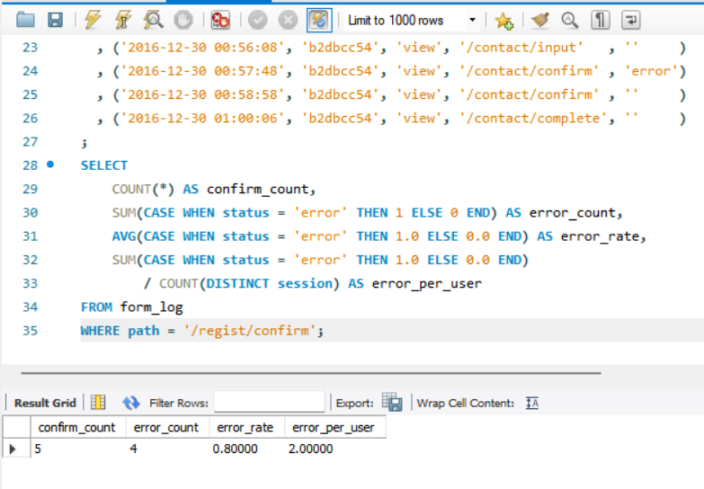

### 3-2 입력 ~ 확인 ~ 완료까지의 이동률 집계하기 

<!-- 이 부분을 지우고 새롭게 배운 내용을 자유롭게 정리해주세요. -->

```sql
WITH mst_fallout_step AS (
    SELECT 1 AS step, '/regist/input' AS path
    UNION ALL SELECT 2, '/regist/confirm'
    UNION ALL SELECT 3, '/regist/complete'
),
form_log_with_fallout_step AS (
    SELECT
        l.session,
        m.step,
        m.path,
        MAX(l.stamp) AS max_stamp,
        MIN(l.stamp) AS min_stamp
    FROM mst_fallout_step AS m
    JOIN form_log AS l
        ON m.path = l.path
    WHERE l.status = ''
    GROUP BY
        l.session,
        m.step,
        m.path
),
form_log_with_mod_fallout_step AS (
    SELECT
        session,
        step,
        path,
        max_stamp,
        LAG(min_stamp) OVER (
            PARTITION BY session
            ORDER BY step
        ) AS lag_min_stamp,
        MIN(step) OVER (
            PARTITION BY session
        ) AS min_step,
        COUNT(1) OVER (
            PARTITION BY session
            ORDER BY step
            ROWS BETWEEN UNBOUNDED PRECEDING AND CURRENT ROW
        ) AS cum_count
    FROM form_log_with_fallout_step
),
fallout_log AS (
    SELECT
        session,
        step,
        path
    FROM form_log_with_mod_fallout_step
    WHERE min_step = 1
      AND step = cum_count
      AND (
            lag_min_stamp IS NULL
         OR max_stamp >= lag_min_stamp
      )
)
SELECT
    step,
    path,
    COUNT(1) AS count,
    100.0 * COUNT(1)
        / FIRST_VALUE(COUNT(1)) OVER (
            ORDER BY step ASC
            ROWS BETWEEN UNBOUNDED PRECEDING AND UNBOUNDED FOLLOWING
        ) AS first_trans_rate,
    100.0 * COUNT(1)
        / LAG(COUNT(1)) OVER (
            ORDER BY step ASC
        ) AS step_trans_rate
FROM fallout_log
GROUP BY step, path
ORDER BY step;
```
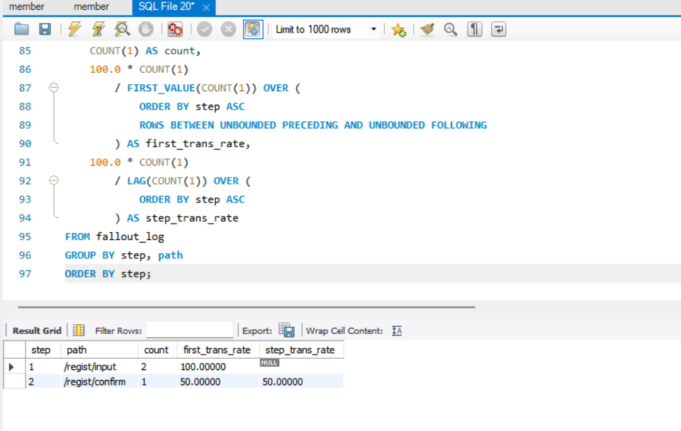

### 3-3 입력 양식 직귀율 집계하기 

<!-- 이 부분을 지우고 새롭게 배운 내용을 자유롭게 정리해주세요. -->

```sql
WITH form_with_progress_flag AS (
    SELECT
        SUBSTRING(stamp, 1, 10) AS dt,
        session,
        SIGN(SUM(CASE WHEN path IN ('/regist/input') THEN 1 ELSE 0 END)) AS has_input,
        SIGN(SUM(CASE WHEN path IN ('/regist/confirm', '/regist/complete') THEN 1 ELSE 0 END)) AS has_progress
    FROM form_log
    GROUP BY
        SUBSTRING(stamp, 1, 10),
        session
)
SELECT
    dt,
    COUNT(1) AS input_count,
    SUM(CASE WHEN has_progress = 0 THEN 1 ELSE 0 END) AS bounce_count,
    100.0 * AVG(CASE WHEN has_progress = 0 THEN 1 ELSE 0 END) AS bounce_rate
FROM form_with_progress_flag
WHERE has_input = 1
GROUP BY dt
ORDER BY dt;
```

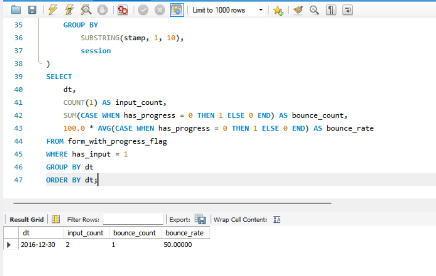

### 3-4 오류가 발생하는 항목과 내용 집계하기 

<!-- 이 부분을 지우고 새롭게 배운 내용을 자유롭게 정리해주세요. -->

```sql
SELECT
    form,
    field,
    error_type,
    COUNT(1) AS count,
    100.0 * COUNT(1) / SUM(COUNT(1)) OVER (
        PARTITION BY form
    ) AS share
FROM form_error_log
GROUP BY
    form,
    field,
    error_type
ORDER BY
    form,
    count DESC;
```

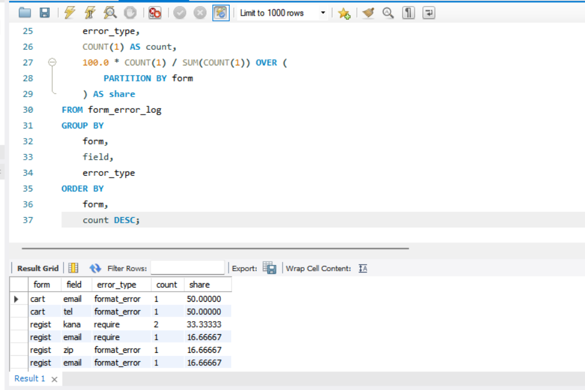 

### 🎉 수고하셨습니다.
